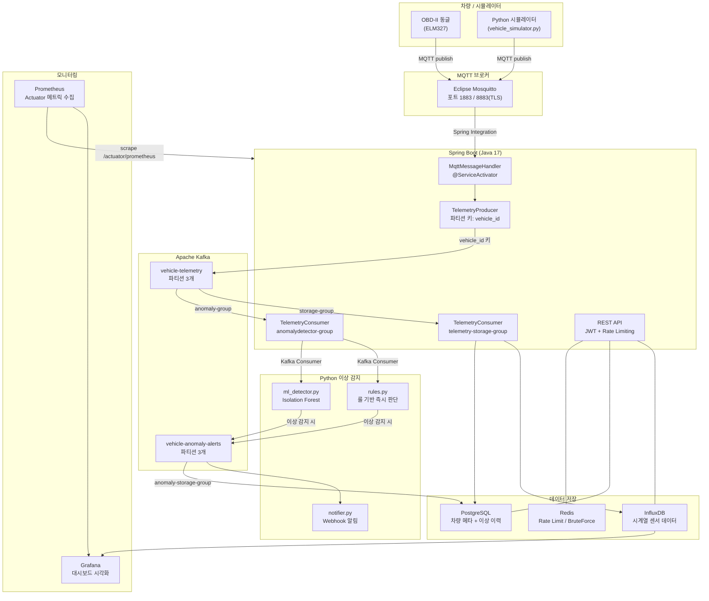

# 차량 텔레메트리 데이터 수집 & 모니터링 플랫폼

> 백엔드/서버 엔지니어 포트폴리오 프로젝트  
> 실시간 차량 센서 데이터 수집 → 이상 감지 → 시각화까지 처리하는 서버 플랫폼

---

## 프로젝트 개요

OBD-II 동글 또는 시뮬레이터에서 발생하는 차량 센서 데이터를 MQTT로 수신하고, Kafka를 통해 분산 처리한 뒤 이상 감지 및 모니터링까지 수행하는 IoT 백엔드 플랫폼입니다.

- **핵심 키워드**: 실시간 스트리밍, 대용량 처리, IoT 백엔드, 커넥티드카
- **개발 기간**: 2026.01 ~ 진행 중
- **개발자**: 박성원 (Park Sungwon)

---

## 시스템 아키텍처



---

## 기술 스택

| 영역 | 기술 |
|------|------|
| 데이터 수신 | MQTT (Eclipse Mosquitto) |
| 메시지 큐 | Apache Kafka |
| 백엔드 API | Java 17 + Spring Boot 3 |
| 이상 감지 | Python 3.11 (룰 기반 + scikit-learn) |
| 시계열 DB | InfluxDB |
| 관계형 DB | PostgreSQL |
| 캐시 | Redis |
| 모니터링 | Grafana + Prometheus |
| 차량 시뮬레이터 | Python / C |
| 보안 | JWT, TLS/SSL, Rate Limiting, 이상 접근 감지 |
| 인프라 | Docker Compose, AWS EC2 (선택) |

---

## 수집 데이터 스펙 (OBD-II 기준)

```json
{
  "vehicle_id": "KR-GA-1234",
  "timestamp": "2026-05-09T10:00:00Z",
  "speed": 87.3,
  "rpm": 2400,
  "engine_temp": 92.1,
  "throttle_position": 34.5,
  "fuel_level": 67.0,
  "battery_voltage": 13.8,
  "gps": {
    "lat": 37.123456,
    "lng": 127.654321
  },
  "dtc_codes": []
}
```

---

## 디렉토리 구조

```
vehicle-telemetry-platform/
├── simulator/          # 차량 데이터 시뮬레이터 (Python/C)
├── broker/             # Mosquitto MQTT 브로커 설정
├── kafka/              # Kafka 설정 및 토픽 초기화 스크립트
├── backend/            # Spring Boot API 서버
│   ├── src/
│   └── build.gradle
├── anomaly-detector/   # Python 이상 감지 모듈
├── monitoring/         # Grafana + Prometheus 설정
├── docs/               # 개발 일지 및 설계 문서
├── docker-compose.yml
├── .env.example
└── README.md
```

---

## 구현 단계 (Phase)

| Phase | 내용 | 상태 |
|-------|------|------|
| 1 | 데이터 수집 파이프라인 (시뮬레이터 → MQTT → Kafka → InfluxDB) | 완료 |
| 2 | REST API 서버 (Spring Boot + JWT + Rate Limiting) | 완료 |
| 3 | 이상 감지 (룰 기반 + Isolation Forest ML) | 완료 |
| 4 | 보안 강화 (X.509 준비, BruteForce 차단, 감사 로그) | 완료 |
| 5 | 모니터링 & 배포 (Grafana + Prometheus + Docker Compose) | 완료 |
| 6 | 버그 픽스 (Actuator 인증 우회/정보 노출, 예외 처리 보강) | 완료 |
| 7 | Refresh Token + 로그아웃 무효화 (Redis 기반) | 완료 |
| 8 | 데이터 파이프라인 안정성 (InfluxDB 배치 쓰기, Kafka DLQ) | 완료 |
| 9 | AI 진단 (Gemini API) | 완료 |
| 10 | MQTT mTLS 실제 활성화 | 예정 |

---

## 향후 계획

| 항목 | 내용 |
|------|------|
| AWS EC2 배포 | Docker Compose 기반으로 실제 서버에 배포 (또는 Render 무료 티어) |
| MQTT X.509 mTLS 활성화 | 인증서/설정은 준비됨(Phase 4) → `mqtt.tls.enabled` 플래그로 실제 적용 예정(Phase 10) |
| 다중 사용자 지원 | 현재 admin 단일 계정 → DB 기반 사용자 관리로 교체. 도입 시 차량 소유자 검증(IDOR 차단)도 함께 필요 |
| WebSocket 실시간 대시보드 | REST 폴링 → WebSocket 푸시로 전환해 지연 최소화 |
| DLQ 재처리 컨슈머 | 현재 DLQ는 유실 방지/격리까지만 — 재처리 자동화는 미구현 |

> JWT 블랙리스트(로그아웃 무효화), InfluxDB 배치 쓰기, Kafka DLQ는 Phase 7~8에서 처리 완료.

---

## 장애 시나리오 및 동작

실제 운영에서 발생할 수 있는 장애 상황별로 시스템이 어떻게 동작하는지 정리했다.

### 시나리오 1 — Kafka 브로커 다운

| 단계 | 동작 |
|------|------|
| 장애 발생 | Spring Boot `TelemetryProducer`의 `kafkaTemplate.send()` 실패 |
| 즉각 영향 | 차량 데이터가 InfluxDB/이상 감지로 전달되지 않음 |
| MQTT 수신 | Mosquitto는 독립적으로 계속 동작. 데이터는 Spring Boot까지 도달 |
| 복구 시 | Kafka 재시작 후 Spring Boot가 자동 재연결, 이후 수신된 데이터부터 정상 처리 |
| 미구현 한계 | Kafka 다운 중 수신한 메시지는 유실됨. DLQ(Dead Letter Queue) 도입으로 해결 가능 |

### 시나리오 2 — Python 이상 감지 서비스 다운

| 단계 | 동작 |
|------|------|
| 장애 발생 | `anomaly-detector` 컨테이너 종료 |
| 즉각 영향 | 이상 감지 중단, Webhook 알림 중단 |
| 데이터 파이프라인 | `telemetry-storage-group`은 별도 Consumer Group이므로 InfluxDB 저장은 영향 없이 계속됨 |
| Kafka 메시지 | `anomaly-detector-group` offset이 멈춘 상태로 유지 — 재시작 시 밀린 메시지부터 재처리 |
| 복구 시 | `docker-compose restart anomaly-detector` 후 자동으로 밀린 메시지 처리 시작 |

> Consumer Group 분리의 핵심 이점: 저장 경로와 이상 감지 경로가 독립적이므로 한 쪽 장애가 다른 쪽에 전파되지 않는다.

### 시나리오 3 — MQTT 브로커(Mosquitto) 재시작

| 단계 | 동작 |
|------|------|
| 장애 발생 | Mosquitto 컨테이너 재시작 |
| Spring Boot | `MqttPahoMessageDrivenChannelAdapter`의 `automaticReconnect=true` 설정으로 자동 재연결 시도 |
| 시뮬레이터 | `paho-mqtt`의 재연결 로직으로 자동 재구독 |
| 재연결 소요 시간 | `connectionTimeout=10s`, `keepAliveInterval=60s` 기준 수 초 내 복구 |
| 재연결 중 데이터 | 연결이 끊긴 사이 시뮬레이터가 발행한 메시지는 유실 (QoS 1 기준, 브로커 재시작이므로 세션 복원 불가) |

### 시나리오 4 — InfluxDB 쓰기 실패

| 단계 | 동작 |
|------|------|
| 장애 발생 | InfluxDB 응답 불가 또는 쓰기 타임아웃 |
| 동작 | `TelemetryRepository.save()` 에서 예외 발생 → `RuntimeException` 상위 전달 |
| Kafka offset | 예외 발생 시 해당 메시지의 offset이 커밋되지 않음 → Kafka가 재처리 시도 |
| 로그 | `[InfluxDB] 쓰기 실패 — vehicle={} timestamp={}` ERROR 레벨 기록 |
| 미구현 한계 | 반복 실패 메시지가 무한 재처리될 수 있음. DLQ + 재처리 횟수 제한 필요 |

### 시나리오 5 — Redis 다운 (Rate Limiting / BruteForce)

| 단계 | 동작 |
|------|------|
| 장애 발생 | Redis 연결 불가 |
| Rate Limiting | `redisTemplate.opsForValue().increment()` 예외 발생 → 요청이 `preHandle()`에서 터짐 |
| 영향 범위 | Rate Limiting과 BruteForce 감지가 비활성화되는 게 아니라 API 전체가 500 응답. Refresh Token(Phase 7)도 Redis에 저장되므로 재로그인(로그인 자체는 영향 없음, 재발급만 불가)도 함께 영향받음 |
| 운영 개선 방향 | Redis 장애 시 Rate Limiting을 bypass하도록 try-catch 추가 고려 (가용성 vs 보안 트레이드오프) |

---

## 이상 감지 룰 (Phase 3 기준)

| 항목 | 이상 조건 |
|------|----------|
| 엔진 온도 | 105°C 초과 |
| RPM | 6000 초과 |
| 배터리 전압 | 11.5V 미만 또는 15V 초과 |
| 속도 | 200km/h 초과 |
| DTC 코드 | 배열이 비어있지 않을 때 |

---

## 테스트 실행

```bash
# Java (JUnit 5)
cd backend
./gradlew test

# Python — 이상 감지 룰 테스트
cd anomaly-detector
pip install -r requirements.txt pytest
pytest

# Python — 시뮬레이터 테스트
cd simulator
pip install -r requirements.txt pytest
pytest
```

---

## 실행 방법

> Docker Compose로 전체 스택을 한 번에 실행합니다.

```bash
# 1. 환경변수 설정
cp .env.example .env
# .env 파일 편집 (GEMINI_API_KEY는 선택 — 없으면 AI 진단 기능만 동작 안 함, 나머지는 정상)

# 2. 전체 스택 실행
docker-compose up -d

# 3. 시뮬레이터 실행
cd simulator
python vehicle_simulator.py
```

---

## OBD-II 실제 연결 (ELM327 동글)

```bash
pip install obd

# 동글을 차량 OBD-II 포트에 연결 후:
import obd
connection = obd.OBD()
response = connection.query(obd.commands.SPEED)
print(response.value)  # 예: 87 kph
```

> OBD-II 동글은 읽기 전용 — 차량 제어 불가, 데이터 수집만 가능

---

## 개발 원칙

- 보안 우선: 모든 통신 TLS, 인증 없는 엔드포인트 금지
- 환경변수는 `.env`로 분리, 하드코딩 금지
- 시뮬레이터 ↔ 실제 OBD-II 전환이 쉽도록 인터페이스 분리
- 테스트: JUnit 5 (Java), pytest (Python)

---

## 참고 자료

- [MQTT 프로토콜](https://mqtt.org)
- [Apache Kafka 공식 문서](https://kafka.apache.org/documentation)
- [python-OBD](https://python-obd.readthedocs.io)
- [InfluxDB 시작하기](https://docs.influxdata.com)
- [UN R155 / ISO SAE 21434 자동차 사이버보안 규제]
