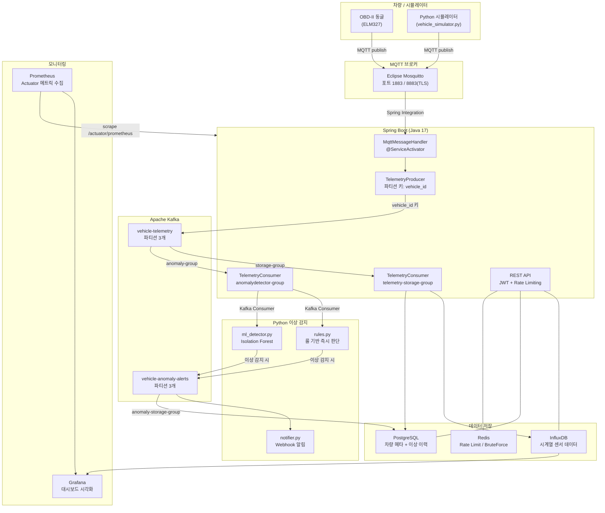

# 차량 텔레메트리 데이터 수집 & 모니터링 플랫폼

> 백엔드/서버 엔지니어 포트폴리오 프로젝트  
> 실시간 차량 센서 데이터 수집 → 이상 감지 → 시각화까지 처리하는 서버 플랫폼

---

## 프로젝트 개요

OBD-II 동글 또는 시뮬레이터에서 발생하는 차량 센서 데이터를 MQTT로 수신하고, Kafka를 통해 분산 처리한 뒤 이상 감지 및 모니터링까지 수행하는 IoT 백엔드 플랫폼입니다.

- **핵심 키워드**: 실시간 스트리밍, 대용량 처리, IoT 백엔드, 커넥티드카
- **개발 기간**: 2026.01 ~ 진행 중
- **개발자**: 박성원 (Park Sungwon)
- **모바일 앱 레포**: https://github.com/Seongwonp/vehicle-telemetry-app (Flutter, 이 백엔드의 API를 사용)

---

## 시스템 아키텍처


```mermaid
flowchart TD
    subgraph Vehicle["차량 / 시뮬레이터"]
        OBD["OBD-II 동글\n(ELM327)"]
        SIM["Python 시뮬레이터\n(vehicle_simulator.py)"]
    end

    subgraph Broker["MQTT 브로커"]
        MQ["Eclipse Mosquitto\n포트 1883 / 8883(TLS)"]
    end

    subgraph SpringBoot["Spring Boot (Java 17)"]
        MQTT_H["MqttMessageHandler\n@ServiceActivator"]
        PROD["TelemetryProducer\n파티션 키: vehicle_id"]
        CONS_S["TelemetryConsumer\ntelemetry-storage-group"]
        CONS_A["TelemetryConsumer\nanomalydetector-group"]
        API["REST API\nJWT + Rate Limiting"]
    end

    subgraph Kafka["Apache Kafka"]
        T1["vehicle-telemetry\n파티션 3개"]
        T2["vehicle-anomaly-alerts\n파티션 3개"]
    end

    subgraph Storage["데이터 저장"]
        INFLUX["InfluxDB\n시계열 센서 데이터"]
        PG["PostgreSQL\n차량 메타 + 이상 이력"]
        REDIS["Redis\nRate Limit / BruteForce"]
    end

    subgraph AnomalyDetector["Python 이상 감지"]
        RULES["rules.py\n룰 기반 즉시 판단"]
        ML["ml_detector.py\nIsolation Forest"]
        NOTIFY["notifier.py\nWebhook 알림"]
    end

    subgraph Monitoring["모니터링"]
        PROM["Prometheus\nActuator 메트릭 수집"]
        GRAFANA["Grafana\n대시보드 시각화"]
    end

    OBD -->|"MQTT publish"| MQ
    SIM -->|"MQTT publish"| MQ
    MQ -->|"Spring Integration"| MQTT_H
    MQTT_H --> PROD
    PROD -->|"vehicle_id 키"| T1

    T1 -->|"storage-group"| CONS_S
    T1 -->|"anomaly-group"| CONS_A

    CONS_S --> INFLUX
    CONS_S --> PG

    CONS_A -->|"Kafka Consumer"| RULES
    CONS_A -->|"Kafka Consumer"| ML
    RULES -->|"이상 감지 시"| T2
    ML -->|"이상 감지 시"| T2
    T2 --> NOTIFY
    T2 -->|"anomaly-storage-group"| PG

    API --- INFLUX
    API --- PG
    API --- REDIS

    PROM -->|"scrape /actuator/prometheus"| SpringBoot
    PROM --> GRAFANA
    INFLUX --> GRAFANA
```

---

## 기술 스택

| 영역 | 기술 |
|------|------|
| 데이터 수신 | MQTT (Eclipse Mosquitto) |
| 메시지 큐 | Apache Kafka |
| 백엔드 API | Java 17 + Spring Boot 3 |
| 이상 감지 | Python 3.11 (룰 기반 + scikit-learn) |
| 시계열 DB | InfluxDB |
| 관계형 DB | PostgreSQL |
| 캐시 | Redis |
| 모니터링 | Grafana + Prometheus |
| 차량 시뮬레이터 | Python / C |
| 보안 | JWT, TLS/SSL, CORS, Rate Limiting, 이상 접근 감지 |
| 인프라 | Docker Compose, AWS EC2 (선택) |

---

## 수집 데이터 스펙 (OBD-II 기준)

```json
{
  "vehicle_id": "KR-GA-1234",
  "timestamp": "2026-05-09T10:00:00Z",
  "speed": 87.3,
  "rpm": 2400,
  "engine_temp": 92.1,
  "throttle_position": 34.5,
  "fuel_level": 67.0,
  "battery_voltage": 13.8,
  "gps": {
    "lat": 37.123456,
    "lng": 127.654321
  },
  "dtc_codes": []
}
```

---

## 디렉토리 구조

```
vehicle-telemetry-platform/
├── simulator/          # 차량 데이터 시뮬레이터 (Python/C)
├── broker/             # Mosquitto MQTT 브로커 설정
├── kafka/              # Kafka 설정 및 토픽 초기화 스크립트
├── backend/            # Spring Boot API 서버
│   ├── src/
│   └── build.gradle
├── anomaly-detector/   # Python 이상 감지 모듈
├── monitoring/         # Grafana + Prometheus 설정
├── docs/               # 개발 일지 및 설계 문서
├── docker-compose.yml
├── .env.example
└── README.md
```

---

## 구현 단계 (Phase)

| Phase | 내용 | 상태 |
|-------|------|------|
| 1 | 데이터 수집 파이프라인 (시뮬레이터 → MQTT → Kafka → InfluxDB) | 완료 |
| 2 | REST API 서버 (Spring Boot + JWT + Rate Limiting) | 완료 |
| 3 | 이상 감지 (룰 기반 + Isolation Forest ML) | 완료 |
| 4 | 보안 강화 (X.509 준비, BruteForce 차단, 감사 로그) | 완료 |
| 5 | 모니터링 & 배포 (Grafana + Prometheus + Docker Compose) | 완료 |
| 6 | 버그 픽스 (Actuator 인증 우회/정보 노출, 예외 처리 보강) | 완료 |
| 7 | Refresh Token + 로그아웃 무효화 (Redis 기반) | 완료 |
| 8 | 데이터 파이프라인 안정성 (InfluxDB 동기 쓰기-수동 offset 연계, Kafka DLQ) | 완료 |
| 9 | AI 진단 (Gemini API) | 완료 |
| 10 | MQTT mTLS 실제 활성화 (기본 Compose는 8883/mTLS, 평문은 명시적 dev override만 허용) | 완료 |
| 11 | Flutter 모바일 앱 연동 — 브라우저(Flutter Web)에서 API 호출을 허용하는 CORS 지원 추가 | 완료 |
| 12 | 이상 감지 서비스(Python) 다중 인스턴스화 — 단일 인스턴스 lag 발산 문제에 Consumer Group 다중화 적용, 재검증에서 순발산 없음 확인(단, 동일 조건 A/B는 아직 — 향후 계획 참고) | 완료(검증 계속 진행 중) |
| 13 | 이상 감지 서비스 처리 신뢰성 — 수동 커밋(개수/시간 배치) + DLQ(`vehicle-telemetry-anomaly-dlq`) 도입, 발행 실패도 처리 실패로 감지 | 완료 |
| 14 | ML 이상 감지 다중 인스턴스 대응 — 슬라이딩 윈도우(버퍼 상한) + 주기적 재학습, 파티션 ID 기준 Redis 영속화로 재시작/리밸런싱 시 학습 상태 유지 | 완료 |
| 15 | 보안/신뢰성 보강 — 검증된 ID 기반 Flux 생성+InfluxDB 2.7 계약 테스트, 신뢰 프록시, STOMP 구독 인가, 차량별 mTLS/ACL, 로컬 Kafka spool, Flyway | 완료 |
| 16 | ML 탐지 품질 채점 체계 — 시뮬레이터 정답(`[GT]`) 로깅 + 복합 이상 시나리오 4종, `score_ml.py` 채점, 피처 누락(`throttle_position`) 발견·수정 | 완료(오탐 문제는 미해결 — 향후 계획 참고) |
| 17 | ML 오탐 원인 규명·수정 — 워밍업 모델 회귀(정상의 91% 오탐) 수정, 점수 덤프 기반 임계값 스윕(`ML_SCORE_THRESHOLD`) 도입 | 완료(임계값 기본값은 미정 — 향후 계획 참고) |

---

## 향후 계획

| 항목 | 내용 |
|------|------|
| AWS EC2 배포 | Docker Compose 기반으로 실제 서버에 배포 (또는 Render 무료 티어) |
| 다중 사용자 지원 | 현재 admin 단일 계정 → DB 기반 사용자 관리로 교체. 도입 시 차량 소유자 검증(IDOR 차단)도 함께 필요 |
| ~~DLQ 재처리 컨슈머~~ | **도구·Runbook 완료(2026-09-04~05)** — 실패 원인 헤더(`x-dlq-*`) + 원인별 분류·재처리 도구(`dlq-tools/dlq.py`) + [Runbook](docs/runbook/dlq-reprocessing.md). 텔레메트리(InfluxDB)와 이상 알림(PostgreSQL) 모두 **재처리 멱등성을 실측으로 확인**했다. 다만 **자동 재처리 컨슈머는 여전히 없다** — "언제 원인이 복구됐다고 볼 것인가"를 기계가 틀리면 루프가 되기 때문 |
| 차량별 MQTT 인증서/ACL 세분화 | 완료 — backend는 `telemetry-backend` 구독자 인증서, 차량은 CN=`vehicle_id` 인증서와 `vehicle/telemetry/%u` 발행 ACL 사용 |
| InfluxDB 읽기 경로 개선 | REST 조회(`/latest`, `/telemetry`)가 InfluxDB 동시 쿼리 용량에 막혀 PostgreSQL 조회보다 최대 40배 느림 — 스케일링/캐싱/쿼리 최적화 필요 |
| InfluxDB batchSize/flush 튜닝, acks=all vs acks=1 비교 | 부하 테스트 범위에서 비교 측정하지 못함 |
| kafka-python 버전 고정 | `anomaly-detector/requirements.txt`가 `>=2.0.2`로만 열려 있어 재빌드 시마다 버전이 달라질 수 있음(재현성) |
| ~~이상 감지 다중화 동일 조건 A/B 재검증~~ | **완료(2026-09-01~03)** — 실부하 약 9,000 msg/s에서 1 vs 2 vs 3인스턴스 A/B, 3인스턴스 6시간 soak까지 마쳤다. `docs/load-test-plan.md` 7~9차 측정 |
| ~~DLQ 격리 메시지 재처리~~ | **완료(2026-09-05)** — `vehicle-anomaly-alerts-dlq` 재처리가 PostgreSQL에 중복 알림을 만드는지 측정했다. `UNIQUE(event_id)` + `ON CONFLICT DO NOTHING`으로 **행 중복 0**(두 번 되돌려도 증가 0). 대신 중복 *알림*(WebSocket)이 나가던 결함을 찾아 고쳤다 — [측정](load-test/anomaly-dlq-idempotency/), ADR-020. `vehicle-telemetry-mqtt-dlq`는 payload가 envelope이라 여전히 재처리 미지원 |
| 이상 감지 웹훅 동기 호출 | `notifier.send_webhook`이 이상 감지마다 동기로 호출됨 — 느려지면 전체 처리량에 영향 줄 수 있어 비동기화/타임아웃 튜닝 검토. **ML을 켜면 알림이 처리량의 약 5%(전 부하 환산 초당 480건)라 이 항목의 중요도가 크게 올라간다**(ADR-018) |

### ML 이상 감지 — 다음 작업 (2026-09-04 기준, 우선순위 순)

14차 측정까지의 결과는 `docs/load-test-plan.md` 10~14차 절과 ADR-018에 있다.
아래는 **아직 안 한 것**만 추린 것이다.

> 직전 목록의 1·2번(`throttle_position` 추가, 오염 없는 재채점)은 14차에 완료했고,
> **1번(`contamination` 재설계)과 2번(오탐 원인 규명)도 15·16차에 완료했다.**
> 오탐의 원인은 추정했던 것(스로틀 분산, 버퍼 오염)이 아니라 **200건으로 학습한
> 최초 모델이 정상 트래픽의 91%를 찍고 60초간 교체되지 않는 것**이었다 — 재학습 폭주를
> 잡으려 넣은 시간 하한이 워밍업에도 걸린 회귀였다. 고치니 정상 구간 판정률이
> **24.44% → 6.55%**. 그 위에서 점수 임계값 스윕을 돌려 `ML_SCORE_THRESHOLD`를 도입했다.

| # | 항목 | 왜 / 무엇을 조심할 것 |
|---|------|----------------------|
| 1 | **`ML_SCORE_THRESHOLD` 기본값 정하기** | 임계값 메커니즘은 만들었지만 **기본값은 비워둔 상태**(= 기존 `offset_` 동작)다. 측정된 -0.55~-0.53은 이 시뮬레이터의 점수 분포라 상수로 박으면 과적합된다. 학습 시점에 **정상 데이터의 분위수로 임계값을 자동 산출**하는 쪽이 근본적이며, 그러려면 아래 2번이 먼저다 |
| 2 | **룰이 잡은 이상을 학습에서 제외** | 지금은 룰이 이미 이상이라 판정한 샘플도 학습 버퍼에 들어간다 — "정상 분포를 배우는 모델"에 아는 이상을 먹이는 셈이다. 제외하면 학습 분포가 깨끗해져 임계값 자동 산출의 근거가 생긴다. 값싸고 독립적으로 측정 가능 |
| 3 | **학습 윈도우를 시간 기준으로** | `window_size`가 건수라 시간 폭이 처리량에 좌우된다(파티션당 500 msg/s에서 2,000건 = 약 4초). 처리량을 올릴 때마다 조용히 짧아진다 — `retrain_interval`을 시간 기준으로 바꾼 것과 같은 수정이 필요하다. Redis 상태 저장 주기(현재 커밋 주기 5초에 묶임)도 함께 봐야 한다 |
| 4 | **재학습 주기 적정성 측정** | `retrain_min_seconds=60`은 성능만 보고 정한 값이라 concept drift 대응으로 충분한지 미검증. 시뮬레이터의 `DRIFT_TEMP_DELTA`로 정상 분포를 이동시킨 뒤 알림률이 돌아오는 시간을 재면 된다 |
| 5 | ML 켠 상태 장기 soak | 11차 기준 ML ON은 유입과 겨우 균형이고 백로그가 안 줄었다. 장시간 안정성은 미확인 |

> **측정 시 반드시 지킬 것** (이번 세션에서 실제로 당한 것들):
> - 부하를 걸었으면 **입력단에서 도달량을 먼저 확인**한다 — 여러 측정이 부하 미도달 상태에서 이뤄진 전례가 있다(`load-test/anomaly-detector-scale/README.md`의 절차).
> - 시뮬레이터를 `--rm`으로 띄웠으면 **정답 로그를 내리기 전에 파일로 받아둔다** — 컨테이너를 지우면 로그가 사라진다.
> - **돌아가는 중에 Kafka 토픽을 삭제하지 않는다** — 프로듀서가 계속 실패하며 컨슈머가 멈춘다.
> - **측정 전에 알림 토픽을 비운다** — 안 그러면 앞선 실행의 알림까지 채점돼 오탐률이
>   엉뚱하게 나온다(16차에서 실제로 당했다). 단, 지우고 **곧바로 다시 만든 뒤** 탐지기를
>   재시작할 것.
> - 검증 전 `build --no-cache`로 **이미지가 실제로 갱신됐는지 확인**한다 — 캐시된 구버전으로 측정해 무의미해진 적이 있다.

> Refresh Token은 Redis GETDEL 기반 rotation과 로그아웃 폐기를 지원한다. Access Token은 10분 만료의
> stateless JWT이며 별도 jti 블랙리스트는 두지 않는다. 즉시 강제 로그아웃이 요구되면 jti 블랙리스트를 추가한다.

---

## 장애 시나리오 및 동작

실제 운영에서 발생할 수 있는 장애 상황별로 시스템이 어떻게 동작하는지 정리했다.

### 시나리오 1 — Kafka 브로커 다운

| 단계 | 동작 |
|------|------|
| 장애 발생 | Spring Boot `TelemetryProducer`의 `kafkaTemplate.send()` 실패 |
| 즉각 영향 | 차량 데이터가 즉시 InfluxDB/이상 감지로 전달되지 않음 |
| MQTT 수신 | Mosquitto는 독립적으로 계속 동작. 데이터는 Spring Boot까지 도달 |
| 복구 시 | 전송 전 로컬 volume에 기록한 spool을 Kafka ACK 후 삭제하며, 재연결 시 보류 파일부터 재전송 |
| 미구현 한계 | spool volume 자체가 손실되면 복구 불가. 운영에서는 디스크 사용량 경보와 HA 수집 계층 필요 |

### 시나리오 2 — Python 이상 감지 서비스 다운

| 단계 | 동작 |
|------|------|
| 장애 발생 | `anomaly-detector` 컨테이너 종료 |
| 즉각 영향 | 이상 감지 중단, Webhook 알림 중단 |
| 데이터 파이프라인 | `telemetry-storage-group`은 별도 Consumer Group이므로 InfluxDB 저장은 영향 없이 계속됨 |
| Kafka 메시지 | `anomaly-detector-group` offset이 멈춘 상태로 유지 — 재시작 시 밀린 메시지부터 재처리 |
| 복구 시 | `docker-compose restart anomaly-detector` 후 자동으로 밀린 메시지 처리 시작 |

> Consumer Group 분리의 핵심 이점: 저장 경로와 이상 감지 경로가 독립적이므로 한 쪽 장애가 다른 쪽에 전파되지 않는다.

### 시나리오 3 — MQTT 브로커(Mosquitto) 재시작

| 단계 | 동작 |
|------|------|
**90초 정지를 실제로 주입해 측정했다**(2026-09-05,
[`RESULT_20260905_mqtt_broker.md`](load-test/fault-injection/RESULT_20260905_mqtt_broker.md)).
여기 적힌 내용은 그 실측 결과다 — 이전에 추정으로 적어둔 "재연결 중 데이터는 유실된다"는
**틀렸었다.**

| 단계 | 동작 |
|------|------|
| 장애 발생 | Mosquitto 컨테이너 정지(SIGTERM) 90초 |
| Spring Boot | `automaticReconnect=true` + **`maxReconnectDelay=5s`** 로 자동 재연결 |
| 시뮬레이터 | paho가 자동 재연결. QoS 1 메시지는 `publish()`가 `NO_CONN`을 반환해도 송신 큐에 남아 **재연결 시 재전송된다** |
| 재연결 중 데이터 | `cleanSession=false`라 브로커가 백엔드 세션 앞으로 큐잉해준다(`max_queued_messages` 10,000) |
| 실측 유실 | **0건.** 브로커가 PUBACK한 178,451건이 전부 backend·InfluxDB까지 도달 |

> **여기서 실제 버그를 찾았다.** `setMaxReconnectDelay`를 지정하지 않으면 Paho 기본값이
> **128초**다. 브로커가 살아난 뒤에도 백엔드가 한참 붙지 않고, 그동안 브로커가 큐를
> 넘겨 **129,447건을 말없이 버렸다**(전체의 72.1%). 우리 쪽 지표는 전부 "받은 것"만
> 세므로 정상으로 보였고, 유일하게 유실을 아는 지표가 브로커의
> `$SYS/broker/publish/messages/dropped`였다. 상한을 5초로 낮춰 0이 됐다.
> 상세는 ADR-021.

### 시나리오 4 — InfluxDB 쓰기 실패

| 단계 | 동작 |
|------|------|
| 장애 발생 | InfluxDB 응답 불가 또는 쓰기 타임아웃 |
| 동작 | 동기 `WriteApiBlocking` 실패를 listener가 잡아 원본을 DLQ로 발행 |
| Kafka offset | InfluxDB 쓰기 또는 DLQ 발행 성공 뒤에만 수동 커밋. DLQ 발행도 실패하면 미커밋 |
| 로그 | 저장 실패와 DLQ 실패를 서로 다른 ERROR 로그로 기록 |
| 재시도 예산 | `ExponentialBackOff` + **180초**(`KAFKA_RETRY_BUDGET_MS`). 90초 장애 실측에서 **DLQ 76,878건 → 0건**. 이 값은 벽시계가 아니라 **백오프로 쉰 시간의 합**이라 실효 내성은 훨씬 길다 — PostgreSQL 300초 장애에서도 DLQ 0건이었다(ADR-022) |
| 재처리 | 원인 분류·재처리 도구와 [Runbook](docs/runbook/dlq-reprocessing.md) 있음. 자동 재처리 컨슈머는 여전히 없음(의도) |

### 시나리오 5 — Redis 다운 (Rate Limiting / BruteForce)

| 단계 | 동작 |
|------|------|
| 장애 발생 | Redis 연결 불가 |
| Rate Limiting | `redisTemplate.opsForValue().increment()` 예외 발생 → 요청이 `preHandle()`에서 터짐 |
| 영향 범위 | Rate Limiting과 BruteForce 감지가 비활성화되는 게 아니라 API 전체가 500 응답. Refresh Token(Phase 7)도 Redis에 저장되므로 재로그인(로그인 자체는 영향 없음, 재발급만 불가)도 함께 영향받음 |
| 운영 개선 방향 | Redis 장애 시 Rate Limiting을 bypass하도록 try-catch 추가 고려 (가용성 vs 보안 트레이드오프) |

---

## 성능 (실측)

> 로컬 Docker Compose 환경(2026-07~08)에서 부하 테스트로 측정. 상세 방법론·전체 표는
> [부하 테스트 계획 및 결과](docs/load-test-plan.md) 참고.

- **수집 파이프라인**: 시뮬레이터를 3→1,000대까지 스케일해 측정. 단일 프로세스로는 Python
  GIL/스레드 오버헤드로 약 1,000-1,250 msg/s에서 먼저 벽에 부딪혀 백엔드의 진짜 한계를 잴 수
  없었다 — 부하 생성기를 여러 **프로세스**(별도 GIL)로 병렬 실행하도록 개선해 ~2,500 msg/s를
  약 24시간 지속시킨 결과, Kafka Consumer Group으로 분리해둔 두 경로 중 **이상 감지(Python,
  단일 인스턴스) 쪽만 lag이 1,264 → 200만 건 이상으로 폭주**했고, 저장 경로(Java→InfluxDB)는
  같은 시간 내내 lag 수백 단위로 버텼다. 이 시스템의 진짜 첫 확장 병목은 Kafka도 InfluxDB도
  아니라 단일 인스턴스로 도는 이상 감지 서비스였다 — Consumer Group 분리 설계(ADR-002)가
  장애(여기선 성능 저하) 전파를 실제로 막아준 것도 함께 확인.
- **이상 감지 서비스 다중화 — 실부하 A/B로 검증**: `docker-compose.yml`의 `container_name`
  고정을 제거하고 `deploy.replicas: 3`으로 파티션 수(3)에 맞춰 3개 인스턴스를 띄웠다.
  약 9,000 msg/s 실부하에서 동일 이미지·동일 부하·시작 lag 0으로 A/B한 결과, 1인스턴스는
  유입의 약 88%(7,914 msg/s)만 처리해 lag이 147,225 → 397,828로 **선형 발산**한 반면,
  3인스턴스는 유입 전량을 소화하며 lag을 **1,500 이하**로 유지했다.
  **이 측정에는 뒷이야기가 있다** — 앞서 진행한 1시간 A/B와 12시간 soak은 수집
  파이프라인이 막혀 있던 탓에 실제로는 초당 15-20건만 걸린 상태였고(아래 항목 참고),
  그 사실을 나중에 발견해 문서를 정정한 뒤 부하를 복구하고 다시 측정한 것이다.
  이어서 **2인스턴스도 측정해 최소 필요 개수를 확정**했다 — 2개로 유입 전량을 소화하고
  lag도 1,100 이하로 안정적이라, 이 부하에서 3번째 인스턴스는 처리량이 아니라 **N+1 여유**다.
  파티션 3개에 1:1 배정으로 리밸런싱이 단순해지는 이점과, 하나가 죽어도 남은 2개가
  부하를 감당한다는 이유로 `replicas: 3`을 유지한다. 마지막으로 이 구성을 **약 7,500 msg/s
  실부하로 6시간 soak**해 장기 안정성까지 확인했다 — 총 1억 6,195만 건을 처리하는 동안
  lag 평균 914 / 최대 2,734, 드리프트 없음(전반 3시간 918 / 후반 3시간 910). 시작 시
  쌓인 8만 건 백로그는 90초에 따라잡았다.
  자세한 내용은 `docs/architecture-decisions.md` ADR-016, 원시 로그는
  `load-test/anomaly-detector-scale/`.
- **MQTT 브로커 장애에서 72% 유실 발견·복구**: 브로커를 90초 정지시켰다 살리는 실험에서
  **브로커가 PUBACK한 179,532건 중 backend에는 50,087건만 도착**했다(유실 129,445건).
  원인은 우리 쪽 설정이었다 — `MqttConnectOptions.setMaxReconnectDelay()`를 지정하지 않아
  Paho 기본값 **128초**가 적용됐고, `cleanSession=false`라 그동안 브로커가 우리 세션 앞으로
  큐잉하다 `max_queued_messages`(10,000)를 넘기면 **말없이 버렸다.** 재연결 후 실제로 받은
  건 10,002건으로 큐 크기와 정확히 일치한다.
  상한을 5초로 낮춰 **유실 0**(브로커 `$SYS` dropped도 0)이 됐다.
  이 측정의 절반은 **정답 기준을 만드는 일**이었다 — 브로커가 죽으면 그 아래 단계가 전부
  비어 기준이 될 수 없어서, 시뮬레이터가 `publish()` 성공(= 클라이언트 큐 적재)과
  PUBACK 수신(= 브로커가 받음)을 분리해 세도록 계측을 넣었다. 그 과정에서 기준을 두 번
  틀렸고(강제 종료로 묵은 값을 읽음, `NO_CONN`을 유실로 오인), 둘 다 측정치의 모순이
  잡아줬다. ADR-021, `load-test/fault-injection/RESULT_20260905_mqtt_broker.md`.
- **수집 파이프라인 99.8% 유실 발견·복구 (처리량 약 1,170배)**: 위 soak의 "InfluxDB 저장이
  26초 만에 멈췄다"를 추적하다 훨씬 큰 문제를 찾았다. **시뮬레이터가 초당 약 10,000건을
  발행하고 MQTT 브로커가 전량 수신·응답하는 동안 Kafka에는 초당 20건만 도착하고 있었다.**
  원인은 4주 전 신뢰성 개선 커밋이 남긴 두 개의 회귀였다 — (1) MQTT 수신 경로에서 메시지마다
  로컬 spool 파일을 쓰는데(파일시스템 연산 약 5회) 이게 단일 스레드에 락까지 걸린 채
  실행돼 수집 전체가 디스크 지연에 직렬로 묶였고, (2) InfluxDB 저장이 메시지당 HTTP 요청
  1건이라 요청당 WAL fsync가 지배적이었다. 둘 다 "조용한 유실을 막자"는 옳은 의도였지만
  **바꾼 뒤 처리량을 다시 재지 않아** 회귀가 드러나지 않았다 — Kafka lag은 들어온 게 없으니
  정상으로 보였다.
  계측을 붙여 원인을 특정한 뒤(InfluxDB 컨테이너가 CPU 1.66%로 놀면서도 쓰기가 5초
  타임아웃까지 걸린 게 결정적 단서였다), 저장을 배치 쓰기로 묶고 spool을 "실패 시에만"으로
  바꿔 **수집 20 → 약 9,600 msg/s, 저장 8.2 → 약 9,600 msg/s**로 복구했다. 이때
  **안전장치는 되돌리지 않았다** — 여전히 동기 쓰기로 저장을 확인한 뒤에만 offset을 커밋하고,
  spool도 Kafka 장애를 막는다. 상세는 ADR-011/ADR-019, `docs/load-test-plan.md`.
- **ML 이상 감지는 현 구현으로 실부하를 못 버틴다 (측정으로 확인, 기본값 off 유지)**:
  `ML_ENABLED=true`로 재보니 3인스턴스 합계 **303 msg/s**로 룰 기반(약 7,500 msg/s) 대비
  **약 25배 느렸고**, 세 인스턴스 CPU가 모두 90-103%로 포화됐다. 처음엔 주기적 재학습을
  의심했지만 **측정해보니 반대였다** — `fit(2000×7, 100트리)`가 207.5ms인 반면
  `predict(단건)`가 11.5ms라, 500건 처리 시 predict가 **전체 비용의 97%**였다.
  그런데 `predict`는 500건을 한 번에 처리해도 비용이 1건과 사실상 같다(16.84ms vs 15.29ms,
  건당 0.034ms) — **위 InfluxDB 사례와 똑같이 "건당 호출 오버헤드"가 병목**이었다.
  즉 모델을 가볍게 하는 것보다 배치 예측이 정답이었다.
  **진단대로 구현해 28배 회복했다** — 컨슈머 루프를 `poll()` 기반 파티션별 배치로 바꿔
  `predict()`를 배치당 1회만 호출(303 → 4,550 msg/s), 그러자 이번엔 재학습이 병목으로
  드러나(건수 기준이라 처리량이 오르면 빈도도 같이 폭주, 초당 2.67회 → 코어의 55%)
  재학습에 시간 하한 60초를 두어 분당 160회 → 1회로 줄였다(→ **8,436 msg/s**).
  커밋·DLQ 경계는 그대로 메시지 단위로 유지했다. 다만 유입(8,870)과 겨우 균형이라
  여유가 없어 **기본값은 계속 `false`** 로 둔다.
  이어서 탐지 품질을 재려다 **더 근본적인 걸 발견했다** — ML 알림이 처리 건수의 5.71%인데
  이는 `contamination=0.05` 설정값과 일치한다. `contamination`은 탐지율이 아니라 **표시할
  비율**이라, 데이터에 이상이 있든 없든 그만큼을 찍는다. 즉 현재 구성은 "이상 감지"라기보다
  **"가장 바깥쪽 5% 표시"** 이고, 정상 차량만 있어도 항상 5%가 알림으로 뜬다(룰의 2.8배,
  전 부하 환산 초당 약 480건 — 각각이 webhook을 탄다). 실사용하려면 `contamination` 조정이나
  점수 임계값 방식, 알림 억제 계층이 필요하다. 참고로 룰 알림 비율(2.05%)은 시뮬레이터의
  `ANOMALY_RATE=0.02`와 정확히 일치해 측정 자체의 건전성을 교차 검증해준다.
  이어서 **탐지 품질을 채점했다** — 시뮬레이터에 복합 이상 4종과 정답(`[GT]`) 로그를 넣고
  `score_ml.py`로 알림과 조인했더니, 한 유형(`throttle_no_response`) recall이 6.9%로
  유독 낮았고 원인은 튜닝이 아니라 **모델이 `throttle_position`을 아예 안 보는 것**이었다.
  피처를 추가하자 그 유형이 **99.6%**, 복합 이상 전체가 52.1% → **77.4%** 가 됐다.
  다만 순이득은 아니었다 — 알림 총량이 2.4배로 늘고 그중 63.6%가 정상 메시지에 떴다.
  피처를 고쳐도 "상위 5%를 뽑는" 구조가 남아 있는 한 오탐이 함께 따라온다는 뜻이라,
  `contamination` 재설계가 다음 우선순위가 됐다.
  그 오탐을 파고들었더니 **원인이 짐작과 달랐다.** 이상을 하나도 주입하지 않은 부하를
  걸어보니(그러면 ML 알림은 전부 오탐이다) 판정률이 24.4%였고, 재학습 로그를 경계로
  모델 세대별로 가르자 **200건으로 학습한 최초 모델이 정상 트래픽의 91%를 이상이라 찍고
  있었다.** 재학습 폭주를 막으려고 넣은 시간 하한(60초)이 워밍업에도 걸려, 그 모델이
  3만 5천 건을 판정할 때까지 교체되지 않았다 — **성능을 살린 수정이 탐지 품질에 낸
  구멍**이었고 알림'률'만 보느라 안 보였다. 워밍업 중에는 표본이 2배가 될 때마다
  재학습하도록 고쳐 **24.4% → 6.55%**(나쁜 모델의 판정 노출 34,796 → 1,796건).
  그러고 나서야 `contamination`이 고장난 게 아니라 **설계대로 "하위 5%를 찍는" 것**임이
  확인됐고, 모든 메시지의 이상 점수를 덤프해 임계값을 오프라인으로 훑는 방식으로
  대안을 쟀다(부하 1회로 곡선 전체). 임계값을 실제로 켜고 검증하니 **스윕 예측 87.3%,
  실측 89.1%** 로 방법론이 맞았고, 복합 이상 recall 77.4% → **89.1%**, ML 알림 중 정답
  적중 36.4% → **57.4%** 로 **recall과 정밀도가 동시에** 올랐다(룰 recall 100% 유지).
  그래도 알림의 42.6%는 정상 메시지에 떠서, 알림 억제 계층은 여전히 남은 과제다.
  상세는 ADR-018, `docs/load-test-plan.md`.
- **데이터 유실 버그 발견·수정**: InfluxDB `WritePrecision.S`(초 단위)와 시뮬레이터의 초 단위
  타임스탬프가 겹쳐, 차량당 초당 2회 조건에서 같은 초의 메시지가 서로 덮어써 **50%가
  조용히 유실**되고 있었다(Kafka lag은 0으로 정상처럼 보임). 밀리초 정밀도로 수정해
  약 100 msg/s → 약 197 msg/s(목표의 98.5%)로 회복.
- **REST API**: k6로 VU 200까지 부하 테스트. InfluxDB 기반 조회(`/telemetry/latest`, `/telemetry`)의
  p95가 3.7~3.8초까지 늘어나는 것을 확인 — 클라이언트의 동시 요청 한도를 넓혀봤다가 오히려
  InfluxDB 자체가 타임아웃을 뱉는 것을 보고 진짜 병목이 InfluxDB의 동시
  쿼리 처리 용량임을 역으로 검증(PostgreSQL 기반 `/anomalies`는 같은 부하에서 p95 95ms로 40배 빠름).
- **Rate Limit**: 분당 60회 제한이 정확히 61번째 요청부터 429를 반환하는 것을 순차 요청으로 검증.

---

## 이상 감지 룰 (Phase 3 기준)

| 항목 | 이상 조건 |
|------|----------|
| 엔진 온도 | 105°C 초과 |
| RPM | 6000 초과 |
| 배터리 전압 | 11.5V 미만 또는 15V 초과 |
| 속도 | 200km/h 초과 |
| DTC 코드 | 배열이 비어있지 않을 때 |

---

## 테스트 실행

```bash
# Java (JUnit 5)
cd backend
./gradlew test

# Python — 이상 감지 룰 테스트
cd anomaly-detector
pip install -r requirements.txt pytest
pytest

# Python — 시뮬레이터 테스트
cd simulator
pip install -r requirements.txt pytest
pytest
```

---

## 실행 방법

> Docker Compose로 전체 스택을 한 번에 실행합니다.

```bash
# 1. 환경변수 설정
cp .env.example .env
# .env 파일 편집 (GEMINI_API_KEY는 선택 — 없으면 AI 진단 기능만 동작 안 함, 나머지는 정상)

# 2. 전체 스택 실행
docker-compose up -d

# 3. 시뮬레이터 실행
cd simulator
python vehicle_simulator.py
```

---

## OBD-II 실제 연결 (ELM327 동글)

```bash
pip install obd

# 동글을 차량 OBD-II 포트에 연결 후:
import obd
connection = obd.OBD()
response = connection.query(obd.commands.SPEED)
print(response.value)  # 예: 87 kph
```

> OBD-II 동글은 읽기 전용 — 차량 제어 불가, 데이터 수집만 가능

---

## 개발 원칙

- 보안 우선: 모든 통신 TLS, 인증 없는 엔드포인트 금지
- 환경변수는 `.env`로 분리, 하드코딩 금지
- 시뮬레이터 ↔ 실제 OBD-II 전환이 쉽도록 인터페이스 분리
- 테스트: JUnit 5 (Java), pytest (Python)

---

## 문서

| 문서 | 내용 |
|------|------|
| [아키텍처 결정 기록 (ADR)](docs/architecture-decisions.md) | 기술 선택의 이유 — "무엇을 썼냐"가 아니라 "왜 이걸 골랐냐" |
| [DB 스키마](docs/db-schema.md) | PostgreSQL(메타데이터/이상 이력) + InfluxDB(시계열) 스키마 |
| [배포 가이드](docs/deployment-guide.md) | AWS EC2 배포 절차 |
| [보안 자체 점검 보고서](docs/security-report.md) | OWASP Top 10, UN R155 / ISO SAE 21434 기준 점검 결과 |
| [개발 일지](docs/devlog.md) | 날짜별 작업 내용, 결정 사항, 막힌 부분 기록 |

---

## 참고 자료

- [MQTT 프로토콜](https://mqtt.org)
- [Apache Kafka 공식 문서](https://kafka.apache.org/documentation)
- [python-OBD](https://python-obd.readthedocs.io)
- [InfluxDB 시작하기](https://docs.influxdata.com)
- [UN R155 / ISO SAE 21434 자동차 사이버보안 규제]
