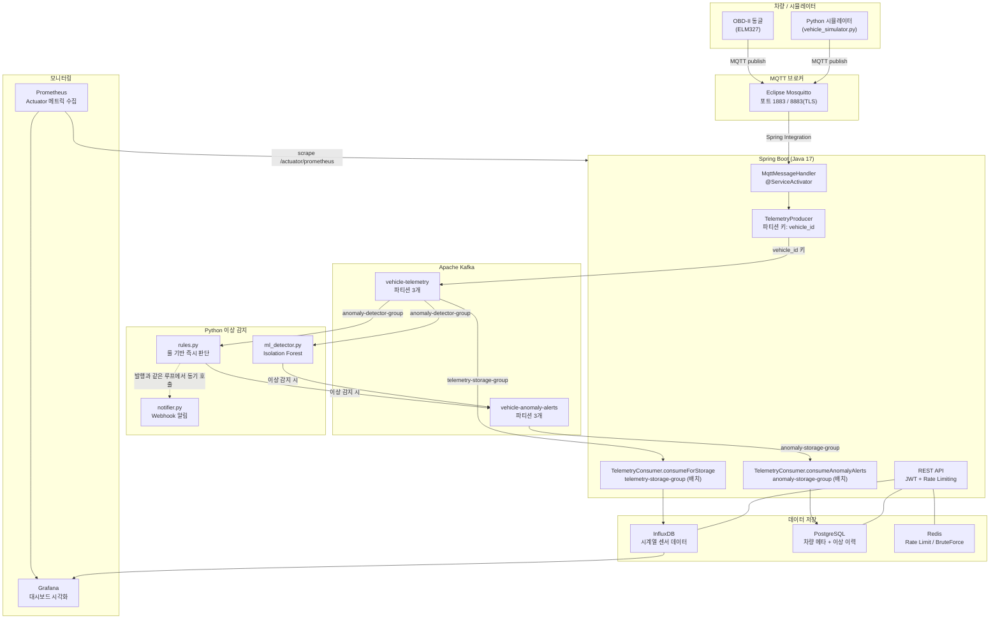

# 차량 텔레메트리 데이터 수집 & 모니터링 플랫폼

> 차량 데이터가 장애 중 어디까지 도달했고 무엇이 유실·중복됐는지를 증명하는
> 백엔드/서버 엔지니어 포트폴리오 프로젝트

---

## 프로젝트 개요

OBD-II 동글 또는 시뮬레이터에서 발생하는 차량 센서 데이터를 MQTT로 수신하고 Kafka를
통해 저장과 이상 감지로 전달한다. 구현 자체보다 PUBACK, Kafka offset, Consumer lag,
InfluxDB 저장 행을 대조해 조용한 유실·중복·순서 역전과 장애 복구 범위를 확인하는 데
초점을 둔다.

- **핵심 키워드**: 차량 데이터 수집, at-least-once, 장애 격리, 재처리, 관측 가능성
- **개발 기간**: 2026.01 ~ 진행 중
- **개발자**: 박성원 (Park Sungwon)
- **모바일 앱 레포**: https://github.com/Seongwonp/vehicle-telemetry-app (Flutter, 이 백엔드의 API를 사용)
- **현재 감사 기준**: [`docs/current-state-audit-2026-09-09.md`](docs/current-state-audit-2026-09-09.md)

---

## 시스템 아키텍처


```mermaid
flowchart TD
    subgraph Vehicle["차량 / 시뮬레이터"]
        OBD["OBD-II 동글\n(ELM327)"]
        SIM["Python 시뮬레이터\n(vehicle_simulator.py)"]
    end

    subgraph Broker["MQTT 브로커"]
        MQ["Eclipse Mosquitto\n포트 1883 / 8883(TLS)"]
    end

    subgraph SpringBoot["Spring Boot (Java 17)"]
        MQTT_H["MqttMessageHandler\n@ServiceActivator"]
        PROD["TelemetryProducer\n파티션 키: vehicle_id"]
        CONS_S["TelemetryConsumer.consumeForStorage\ntelemetry-storage-group (배치)"]
        CONS_AL["TelemetryConsumer.consumeAnomalyAlerts\nanomaly-storage-group (배치)"]
        API["REST API\nJWT + Rate Limiting"]
    end

    subgraph Kafka["Apache Kafka"]
        T1["vehicle-telemetry\n파티션 3개"]
        T2["vehicle-anomaly-alerts\n파티션 3개"]
    end

    subgraph Storage["데이터 저장"]
        INFLUX["InfluxDB\n시계열 센서 데이터"]
        PG["PostgreSQL\n차량 메타 + 이상 이력"]
        REDIS["Redis\nRate Limit / BruteForce"]
    end

    subgraph AnomalyDetector["Python 이상 감지"]
        RULES["rules.py\n룰 기반 즉시 판단"]
        ML["ml_detector.py\nIsolation Forest"]
        NOTIFY["notifier.py\nWebhook 알림"]
    end

    subgraph Monitoring["모니터링"]
        PROM["Prometheus\nActuator 메트릭 수집"]
        GRAFANA["Grafana\n대시보드 시각화"]
    end

    OBD -->|"MQTT publish"| MQ
    SIM -->|"MQTT publish"| MQ
    MQ -->|"Spring Integration"| MQTT_H
    MQTT_H --> PROD
    PROD -->|"vehicle_id 키"| T1

    T1 -->|"telemetry-storage-group"| CONS_S
    T1 -->|"anomaly-detector-group"| RULES
    T1 -->|"anomaly-detector-group"| ML

    CONS_S --> INFLUX

    RULES -->|"이상 감지 시"| T2
    ML -->|"이상 감지 시"| T2
    RULES -.->|"발행과 같은 루프에서 동기 호출"| NOTIFY
    T2 -->|"anomaly-storage-group"| CONS_AL
    CONS_AL --> PG

    API --- INFLUX
    API --- PG
    API --- REDIS

    PROM -->|"scrape /actuator/prometheus"| SpringBoot
    PROM --> GRAFANA
    INFLUX --> GRAFANA
```

---

## 기술 스택

| 영역 | 기술 |
|------|------|
| 데이터 수신 | MQTT (Eclipse Mosquitto) |
| 메시지 큐 | Apache Kafka |
| 백엔드 API | Java 17 + Spring Boot 3 |
| 이상 감지 | Python 3.11 (룰 기반 + scikit-learn) |
| 시계열 DB | InfluxDB |
| 관계형 DB | PostgreSQL |
| 캐시 | Redis |
| 모니터링 | Grafana + Prometheus |
| 차량 시뮬레이터 | Python / C |
| 보안 | JWT, TLS/SSL, CORS, Rate Limiting, 이상 접근 감지 |
| 인프라 | Docker Compose — 실제 배포 환경과 롤백은 미검증 |

---

## 수집 데이터 스펙 (OBD-II 기준)

```json
{
  "vehicle_id": "KR-GA-1234",
  "timestamp": "2026-05-09T10:00:00Z",
  "speed": 87.3,
  "rpm": 2400,
  "engine_temp": 92.1,
  "throttle_position": 34.5,
  "fuel_level": 67.0,
  "battery_voltage": 13.8,
  "gps": {
    "lat": 37.123456,
    "lng": 127.654321
  },
  "dtc_codes": []
}
```

---

## 디렉토리 구조

```
vehicle-telemetry-platform/
├── simulator/          # 차량 데이터 시뮬레이터 (Python/C)
├── broker/             # Mosquitto MQTT 브로커 설정
├── kafka/              # Kafka 설정 및 토픽 초기화 스크립트
├── backend/            # Spring Boot API 서버
│   ├── src/
│   └── build.gradle
├── anomaly-detector/   # Python 이상 감지 모듈
├── monitoring/         # Grafana + Prometheus 설정
├── docs/               # 개발 일지 및 설계 문서
├── docker-compose.yml
├── .env.example
└── README.md
```

---

## 검증 중심 개발 상태

기능을 몇 단계까지 만들었는지보다 어떤 위험을 실제로 닫았는지를 기준으로 정리한다.
40개 단계의 전체 이력과 미검증 갈래는 [고도화 로드맵](docs/roadmap.md), 날짜별 시행착오는
[개발 일지](docs/devlog.md)에 남아 있다.

| 영역 | 현재 확인된 결과 | 남은 한계 |
| --- | --- | --- |
| 저장 신뢰성 | InfluxDB 저장 성공 또는 DLQ 발행 성공 뒤에만 offset을 수동 커밋 | 누락 primitive와 일부 schema 변환이 조용히 통과 |
| 경로 격리 | 이상 감지 lag 200만+에서도 별도 Consumer Group인 저장 경로가 영향 없이 처리 | 단일 Kafka broker와 RF=1 |
| MQTT 복구 | 90초 broker 장애에서 재연결/queue 수정 후 PUBACK 기준 유실 0 | queue·spool 용량을 넘는 장애와 volume 손실은 보장하지 않음 |
| 중복·재처리 | consumer kill 재전달과 anomaly DLQ replay에서 저장 멱등성 확인 | 논리적 중복의 정의는 schema에 아직 없음 |
| 저장 확장 | 수집 1 + 저장 전용 N 구조를 Compose `scale` 프로파일로 재현 | 정적 멤버십 ON은 scale-down 시 46~54초 지연 |
| 성능 | 배치화로 병목을 개선했고 InfluxDB write latency 증가를 확인 | 반복 결과가 크게 흔들려 최대 처리량 숫자 주장은 철회 |
| 앱 | 반응형·테마·WebSocket stale/out-of-order 방어와 Flutter CI | 실제 기기 E2E와 스크린샷 증거는 미완료 |

### 현재 우선순위

1. evidence checksum의 Windows/Linux clean-checkout 재현성 복구
2. 누락/null/type mismatch를 포함한 strict telemetry schema와 공통 ingress 검증
3. Redis 장애 시 endpoint별 가용성/보안 정책 결정 및 장애 실험
4. 하나의 `event_id`로 MQTT→Kafka→저장→알림을 잇는 상관관계
5. Flutter 실제 기기 E2E

상세 위험 목록, 주장-증거 매트릭스, 테스트 전략과 8주 계획은
[현재 상태 감사 및 8주 실행 계획](docs/current-state-audit-2026-09-09.md)에 정리했다.
ML 고도화, 다중 사용자, multi-broker, 배포 롤백은 위 P0/P1을 닫은 뒤 필요성이 확인될 때
진행한다. Kubernetes 도입 자체는 목표로 두지 않는다.

---

## 장애 시나리오 및 동작

실제 운영에서 발생할 수 있는 장애 상황별로 시스템이 어떻게 동작하는지 정리했다.

### 시나리오 1 — Kafka 브로커 다운

| 단계 | 동작 |
|------|------|
| 장애 발생 | Spring Boot `TelemetryProducer`의 `kafkaTemplate.send()` 실패 |
| 즉각 영향 | 차량 데이터가 즉시 InfluxDB/이상 감지로 전달되지 않음 |
| MQTT 수신 | Mosquitto는 독립적으로 계속 동작. 데이터는 Spring Boot까지 도달 |
| 복구 시 | 전송 전 로컬 volume에 기록한 spool을 Kafka ACK 후 삭제하며, 재연결 시 보류 파일부터 재전송 |
| 미구현 한계 | spool volume 자체가 손실되면 복구 불가. 운영에서는 디스크 사용량 경보와 HA 수집 계층 필요 |

### 시나리오 2 — Python 이상 감지 서비스 다운

| 단계 | 동작 |
|------|------|
| 장애 발생 | `anomaly-detector` 컨테이너 종료 |
| 즉각 영향 | 이상 감지 중단, Webhook 알림 중단 |
| 데이터 파이프라인 | `telemetry-storage-group`은 별도 Consumer Group이므로 InfluxDB 저장은 영향 없이 계속됨 |
| Kafka 메시지 | `anomaly-detector-group` offset이 멈춘 상태로 유지 — 재시작 시 밀린 메시지부터 재처리 |
| 복구 시 | `docker-compose restart anomaly-detector` 후 자동으로 밀린 메시지 처리 시작 |

> Consumer Group 분리의 핵심 이점: 저장 경로와 이상 감지 경로가 독립적이므로 한 쪽 장애가 다른 쪽에 전파되지 않는다.

### 시나리오 3 — MQTT 브로커(Mosquitto) 재시작

**90초 정지를 실제로 주입해 측정했다**(2026-09-05,
[`RESULT_20260905_mqtt_broker.md`](load-test/fault-injection/RESULT_20260905_mqtt_broker.md)).
여기 적힌 내용은 그 실측 결과다 — 이전에 추정으로 적어둔 "재연결 중 데이터는 유실된다"는
**틀렸었다.**

| 단계 | 동작 |
|------|------|
| 장애 발생 | Mosquitto 컨테이너 정지(SIGTERM) 90초 |
| Spring Boot | `automaticReconnect=true` + **`maxReconnectDelay=5s`** 로 자동 재연결 |
| 시뮬레이터 | paho가 자동 재연결. QoS 1 메시지는 `publish()`가 `NO_CONN`을 반환해도 송신 큐에 남아 **재연결 시 재전송된다** |
| 재연결 중 데이터 | `cleanSession=false`라 브로커가 백엔드 세션 앞으로 큐잉해준다(`max_queued_messages` **100,000**). 10,000이던 것을 300초 장애에서 4.7% 유실이 나 올렸다 |
| 실측 유실 | **0건.** 브로커가 PUBACK한 178,451건이 전부 backend·InfluxDB까지 도달 |

> **여기서 실제 버그를 찾았다.** `setMaxReconnectDelay`를 지정하지 않으면 Paho 기본값이
> **128초**다. 브로커가 살아난 뒤에도 백엔드가 한참 붙지 않고, 그동안 브로커가 큐를
> 넘겨 **129,447건을 말없이 버렸다**(전체의 72.1%). 우리 쪽 지표는 전부 "받은 것"만
> 세므로 정상으로 보였고, 유일하게 유실을 아는 지표가 브로커의
> `$SYS/broker/publish/messages/dropped`였다. 상한을 5초로 낮춰 0이 됐다.
> 상세는 ADR-021.

### 시나리오 4 — InfluxDB 쓰기 실패

| 단계 | 동작 |
|------|------|
| 장애 발생 | InfluxDB 응답 불가 또는 쓰기 타임아웃 |
| 동작 | 동기 `WriteApiBlocking` 실패를 listener가 다시 던지고 error handler가 재시도. 예산 소진 후 원본을 DLQ로 발행 |
| Kafka offset | InfluxDB 쓰기 또는 DLQ 발행 성공 뒤에만 수동 커밋. DLQ 발행도 실패하면 미커밋 |
| 로그 | 저장 실패와 DLQ 실패를 서로 다른 ERROR 로그로 기록 |
| 재시도 예산 | `ExponentialBackOff` + **180초**(`KAFKA_RETRY_BUDGET_MS`). 90초 장애 실측에서 **DLQ 76,878건 → 0건**. 이 값은 벽시계가 아니라 **백오프로 쉰 시간의 합**이라 실효 내성은 훨씬 길다 — PostgreSQL 300초 장애에서도 DLQ 0건이었다(ADR-022) |
| 재처리 | 원인 분류·재처리 도구와 [Runbook](docs/runbook/dlq-reprocessing.md) 있음. 자동 재처리 컨슈머는 여전히 없음(의도) |

### 시나리오 5 — Redis 다운 (Rate Limiting / BruteForce)

| 단계 | 동작 |
|------|------|
| 장애 발생 | Redis 연결 불가 |
| Rate Limiting | `redisTemplate.opsForValue().increment()` 예외 발생 → 요청이 `preHandle()`에서 터짐 |
| 영향 범위 | Rate Limiting과 BruteForce 감지가 비활성화되는 게 아니라 API 전체가 500 응답. Refresh Token(Phase 7)도 Redis에 저장되므로 재로그인(로그인 자체는 영향 없음, 재발급만 불가)도 함께 영향받음 |
| 운영 개선 방향 | Redis 장애 시 Rate Limiting을 bypass하도록 try-catch 추가 고려 (가용성 vs 보안 트레이드오프) |

---

## 성능 (실측)

> 로컬 Docker Compose 환경(2026-07~08)에서 부하 테스트로 측정. 상세 방법론·전체 표는
> [부하 테스트 계획 및 결과](docs/load-test-plan.md) 참고.
>
> **읽는 법**: 아래 수치는 전부 **단일 머신 Docker Compose** 결과다. 2026-09-05의
> 최초 장애 실험은 대부분 조건별 1회 관찰이었고, 이후 MQTT 90초 장애·anomaly
> rebalancing·storage consumer SIGKILL은 각각 3회 반복했다. 운영 규모의 고가용성이나
> 무제한 확장성을 뜻하지 않는다. 어떤 증거가 있어야 어떤 표현을 쓸 수 있는지는
> [검증 증거 정책](docs/evidence-policy.md)에, 다음에 무엇을 반복 측정할지는
> [로드맵 P0-2](docs/roadmap.md)에 있다.

- **수집 파이프라인**: 시뮬레이터를 3→1,000대까지 스케일해 측정. 단일 프로세스로는 Python
  GIL/스레드 오버헤드로 약 1,000-1,250 msg/s에서 먼저 벽에 부딪혀 백엔드의 진짜 한계를 잴 수
  없었다 — 부하 생성기를 여러 **프로세스**(별도 GIL)로 병렬 실행하도록 개선해 ~2,500 msg/s를
  약 24시간 지속시킨 결과, Kafka Consumer Group으로 분리해둔 두 경로 중 **이상 감지(Python,
  단일 인스턴스) 쪽만 lag이 1,264 → 200만 건 이상으로 폭주**했고, 저장 경로(Java→InfluxDB)는
  같은 시간 내내 lag 수백 단위로 버텼다. 이 시스템의 진짜 첫 확장 병목은 Kafka도 InfluxDB도
  아니라 단일 인스턴스로 도는 이상 감지 서비스였다 — Consumer Group 분리 설계(ADR-002)가
  장애(여기선 성능 저하) 전파를 실제로 막아준 것도 함께 확인.
- **이상 감지 서비스 다중화 — 실부하 A/B로 검증**: `docker-compose.yml`의 `container_name`
  고정을 제거하고 `deploy.replicas: 3`으로 파티션 수(3)에 맞춰 3개 인스턴스를 띄웠다.
  약 9,000 msg/s 실부하에서 동일 이미지·동일 부하·시작 lag 0으로 A/B한 결과, 1인스턴스는
  유입의 약 88%(7,914 msg/s)만 처리해 lag이 147,225 → 397,828로 **선형 발산**한 반면,
  3인스턴스는 유입 전량을 소화하며 lag을 **1,500 이하**로 유지했다.
  **이 측정에는 뒷이야기가 있다** — 앞서 진행한 1시간 A/B와 12시간 soak은 수집
  파이프라인이 막혀 있던 탓에 실제로는 초당 15-20건만 걸린 상태였고(아래 항목 참고),
  그 사실을 나중에 발견해 문서를 정정한 뒤 부하를 복구하고 다시 측정한 것이다.
  이어서 **2인스턴스도 측정해 최소 필요 개수를 확정**했다 — 2개로 유입 전량을 소화하고
  lag도 1,100 이하로 안정적이라, 이 부하에서 3번째 인스턴스는 처리량이 아니라 **N+1 여유**다.
  파티션 3개에 1:1 배정으로 리밸런싱이 단순해지는 이점과, 하나가 죽어도 남은 2개가
  부하를 감당한다는 이유로 `replicas: 3`을 유지한다. 마지막으로 이 구성을 **약 7,500 msg/s
  실부하로 6시간 soak**해 장기 안정성까지 확인했다 — 총 1억 6,195만 건을 처리하는 동안
  lag 평균 914 / 최대 2,734, 드리프트 없음(전반 3시간 918 / 후반 3시간 910). 시작 시
  쌓인 8만 건 백로그는 90초에 따라잡았다.
  자세한 내용은 `docs/architecture-decisions.md` ADR-016, 원시 로그는
  `load-test/anomaly-detector-scale/`.
- **MQTT 브로커 장애에서 72% 유실 발견·복구** (200대·약 1,000 msg/s의 단일 Docker Compose
  환경. 초기 결함/1차 수정 비교는 각 1회, 최종 90초 복구 조건은 이후 3회 반복):
  브로커를 90초 정지시켰다 살리는 최초 실험에서
  **브로커가 PUBACK한 179,532건 중 backend에는 50,087건만 도착**했다(유실 129,445건).
  원인은 우리 쪽 설정이었다 — `MqttConnectOptions.setMaxReconnectDelay()`를 지정하지 않아
  Paho 기본값 **128초**가 적용됐고, `cleanSession=false`라 그동안 브로커가 우리 세션 앞으로
  큐잉하다 `max_queued_messages`(10,000)를 넘기면 **말없이 버렸다.** 재연결 후 실제로 받은
  건 10,002건으로 큐 크기와 정확히 일치한다.
  상한을 5초로 낮춰 **유실 0**(브로커 `$SYS` dropped도 0)이 됐다.
  이 측정의 절반은 **정답 기준을 만드는 일**이었다 — 브로커가 죽으면 그 아래 단계가 전부
  비어 기준이 될 수 없어서, 시뮬레이터가 `publish()` 성공(= 클라이언트 큐 적재)과
  PUBACK 수신(= 브로커가 받음)을 분리해 세도록 계측을 넣었다. 그 과정에서 기준을 두 번
  틀렸고(강제 종료로 묵은 값을 읽음, `NO_CONN`을 유실로 오인), 둘 다 측정치의 모순이
  잡아줬다.

  **그리고 90초로 끝난 줄 알았던 게 아니었다.** 장애를 300초로 늘리자 이번엔 백엔드가
  2초 만에 붙었는데도 **17,243건(4.7%)이 다시 버려졌다** — 밀려 있던 32만 건이 한꺼번에
  쏟아지며 구독자 드레인 속도를 잠깐 넘어섰기 때문이다. "브로커가 버린다"는 같은 증상에
  원인이 둘이었고 첫 번째만 고쳐둔 상태였다. `max_queued_messages`를 10,000 → 100,000으로
  올려 0이 됐다. 세 번 모두 내 계산과 브로커의 `$SYS` dropped가 독립적으로 일치했다.
  ADR-021, `load-test/fault-injection/RESULT_20260905_mqtt_broker.md`.
- **순서 보장 범위를 재고, 파이프라인이 아니라 화면에서 막기로 했다** (200대, 각 1회 관찰):
  정상 경로의 역전은 **0**이다 — `enable.idempotence=true` + `max.in.flight ≤ 5`가
  재시도 중에도 파티션 내 순서를 보장한다. 그런데 Kafka 90초 장애 뒤 로컬 spool을
  드레인하는 구간에서는 **역전 924건(0.38%), 200대 전부, 최대 114초 과거**가 나왔다.
  **1분 미만 역전이 하나도 없다** — 잠깐 뒤섞인 게 아니라 1~2분 묵은 메시지가 뒤늦게
  도착하는 것이다. 이 가설은 `TelemetryProducer` 주석에 적혀만 있었고 재본 적이 없었다.
  영향을 경로별로 갈라보니 저장(identity가 타임스탬프)과 REST 조회(`sort(_time)|>limit(1)`)는
  무관하고 **앱의 실시간 화면 하나만** 영향을 받았다 — 묵은 값이 현재 값으로 표시되고
  "마지막 수신"이 도착 시각으로 갱신돼 stale 표시로도 안 걸러졌다.
  파이프라인에서 순서를 맞추려면 드레인과 신규 발행을 한 락으로 묶어야 하는데 그건
  수집 처리량을 무너뜨린 예전 구조라, **역전은 허용하고 앱에서 오래된 프레임을 버린다**.
  `load-test/order-integrity/`.
- **독성 메시지 한 건이 정상 메시지를 막지는 않지만, 조용히 필드가 사라지는 경로가 있었다**
  (유형당 정상 100건 + 독성 1건, 각 1회 관찰): 깨진 JSON·잘못된 타임스탬프·다른 스키마는
  전부 그 한 건만 DLQ로 격리됐고 대조군 100건은 모두 저장됐다. 그런데 **`{"speed": 1e309}`**
  — 유효한 JSON이고 Jackson이 `Infinity`로 파싱한다 — 는 쓰기가 실패하지 않고
  **그 필드만 빠진 채 저장됐다.** DLQ 0, 에러 로그 0, 카운터 변화 0이라
  정합성 대조(토픽 수 = 행 수)로도 안 잡힌다(행은 있으므로).
  측정 도구도 처음엔 틀렸다 — `json.dumps(inf)`가 비표준 리터럴을 써서 역직렬화
  단계에서 걸렸고, "DLQ에 갔으니 격리 잘 된다"로 끝냈으면 이 발견을 못 봤다.
  **같은 날 고치고 다시 쟀다** — `toPoint()`에 유한값 검사를 넣어 이제 그 레코드만
  DLQ로 간다(저장됨 → **DLQ 1건**, 대조군 100건은 그대로). 건너뛰지 않고 던지는 이유는
  유실을 **보이고 되돌릴 수 있는 형태**로 만들기 위해서다. 그 과정에서 새 예외가
  DLQ 분류에서 `unknown`으로 떨어지는 것도 찾아 고쳤다. `load-test/poison-message/`.
- **같은 180초 재시도 예산이 의존성에 따라 3.7분과 8.1분이 된다** (각 조건 1회 관찰):
  지금까지의 장애 실험은 전부 90~300초라 예산이 소진되는 것을 한 번도 못 봤다.
  같은 **720초** 장애를 의존성만 바꿔 주입하니 첫 DLQ가 **InfluxDB 220초, PostgreSQL 485초**에
  생겼다. PostgreSQL 쪽은 재시도 간격(31/32/34/38/46/60/60초)에서 30초를 빼면 백오프 값
  (1/2/4/8/16/30/30)이 정확히 나온다 — 시도마다 HikariCP `connectionTimeout` 30초를 실패에
  쓰고 **그 시간은 예산에 안 세어진다**. 두 경우 다 리밸런싱 0, 유실 0이다.
  부수적으로 **백로그는 DLQ로 가지 않는다**는 것도 확인했다(DLQ 6,158건은 전부 장애 시작
  직후 26초 구간, 나머지 17만 건은 lag으로 쌓였다가 복구 후 저장). 그리고 **"DLQ에 있다 =
  저장 안 됐다"가 아니다** — InfluxDB 47건, PostgreSQL은 21건 **전부**가 이미 저장된
  in-doubt였다. 이 실험에서 관측 구멍도 하나 나왔다: DLQ로 6,158건이 가는 동안 로그에
  한 줄도 안 남았다(알림 경로는 남기는데 저장 경로만 안 남기는 비대칭). 두 곳 다 고쳤다.
  `load-test/long-outage/`.
- **한 레코드를 앱 직전까지 따라가면 WebSocket 지연 p50 536ms** (마커 20건, 1회 관찰):
  총량 대조는 유실을 잡지만 "어느 단계에서 얼마나 늦는지"와 **저장에서 갈라지는 가지의
  누락**을 못 본다. 표식 차량으로 마커를 흘려 MQTT·Kafka·InfluxDB·REST·WebSocket
  5단계에서 개별 확인한 결과 **20/20 전 단계 도달**, WebSocket p50 536ms / REST 가시성
  p50 680ms(폴링 분해능 500ms).
  여기서도 **측정 도구가 먼저 틀렸다** — REST 지연이 마커 순서대로 정확히 500ms씩 줄어서
  (발행 간격과 같다) 보니, 폴링을 발행 뒤에 시작해 생긴 그림자였다. 먼저 띄우도록 고치니
  p50이 6,078 → 680ms가 됐다. `load-test/e2e-trace/`.
- **리밸런싱이 안 도는 이유는 정적 멤버십이 아니었다** (720초 장애 2회 관찰):
  재시도가 `max.poll.interval.ms`(300초)를 두 배 넘게 초과하는데도 리밸런싱이 0이라
  `group.instance.id` 덕으로 짐작했는데, 리스너 로거를 DEBUG로 올리니 재시도 주체가
  `FallbackBatchErrorHandler`로 찍혔다. **그 안의 `ErrorHandlingUtils.retryBatch`가
  파티션을 pause한 채 `poll(Duration.ZERO)`를 계속 호출한다** — 쓰고 있는 jar를
  javap로 열어 확인했다(`Consumer.pause` / `poll` ×2 / `resume` ×3). 컨슈머가 살아 있으니
  poll 간격이 만료되지 않는다. 코드 주석의 반대 서술을 정정했다.
  같은 조건 2회에서 첫 DLQ 220 → 222초, DLQ 6,158 → 6,185로 재현됐고,
  **in-doubt 건수만 47 → 23으로 흔들린다**(타이밍 문제라 성질처럼 쓰면 안 된다).
- **저장 경로를 통째로 복제하면 용량이 안 늘고 파티션을 뺏는다** (모드별 1회 관찰):
  백엔드가 **MQTT 수집과 Kafka→InfluxDB 저장을 겸하는데** MQTT `client-id`
  (`cleanSession=false`)와 Kafka `group.instance.id`가 둘 다 고정이다. 그대로 3개로
  복제하니 브로커가 앞 세션을 끊고(**연결 끊김 44건**) 정적 멤버가 서로를 밀어내서
  (**`FencedInstanceIdException` 45건**) **컨슈머 멤버가 3에서 늘지 않았다.**
  `mqtt.ingest.enabled` 스위치를 넣어 **수집 1대 + 저장 2대**로 나누니 멤버가 **9**가 되고
  fencing·연결 끊김이 **0**, PUBACK·토픽·InfluxDB 행이 **117,125로 정확히 일치**한다.
  다만 파티션이 3개라 9개 중 6개는 유휴이고, 이 부하(250 msg/s)에서는 1 인스턴스로
  충분해 **처리량 이득은 측정하지 못했다** — "확장 가능한 구조가 됐다"까지가 결론이다.
  naive 쪽 중복·유실 수치는 연결 경합이 QoS 1 재전송을 유발해 **무효**로 표시했다.
  `load-test/storage-scale/`.
- **장애 중에 추적해보니 추적 도구가 먼저 죽었다** (마커 20건, 1회 관찰):
  InfluxDB를 세운 채 같은 추적을 돌리니 MQTT 20/20 · Kafka 20/20 · InfluxDB 0/20 ·
  REST 0/20 · WebSocket 0/20으로 **"최초 미도달 단계=influx"가 마커마다 갈렸다.**
  다만 첫 실행은 결과를 못 냈다 — 저장소 조회가 `ConnectionError`로 프로세스를 죽여서,
  **"어디서 끊겼나"를 재는 도구가 끊긴 단계를 조회하다 죽는** 구조였다. 정상 경로에서만
  돌려봤으니 드러날 수 없었다. WebSocket이 0인 것은 설계대로다 — 브로드캐스트는 저장
  성공 뒤에만 일어나므로 저장이 막히면 앱 화면은 **조용해진다.**
- **이상 알림 저장이 유입의 1/4만 처리하고 있었다** (100대·이상률 0.3, 1회 관찰):
  두 번의 다른 실험에서 "따라잡는 데
  13분이 걸린다"를 보고도 "느리다"고만 적고 넘어갔었다. 재보니 **49 msg/s**, 같은 부하의
  알림 발생량이 193 msg/s라 **lag이 쌓이는 게 정상 동작**이었던 셈이다.
  원인은 레코드 단위 리스너 + 즉시 커밋이라 알림 한 건마다 PostgreSQL fsync 1회와 브로커
  왕복 1회가 붙은 것 — **저장 경로(InfluxDB)에서 똑같은 이유로 8 msg/s까지 떨어진 적이
  있고 배치화로 고쳤는데, 알림 경로는 그때 같이 안 고쳤다.** 같은 모양으로 맞추니
  lag이 20,128 → 238이 됐고 4배 부하에서도 유입을 전량 소화한다.
  그 배치화가 **새 버그를 만들었고 300초 장애 로그의 "배치 저장 실패 0건"이 잡았다** —
  클래스 레벨 `@Transactional` 때문에 DB를 안 건드리는 변환 메서드까지 트랜잭션을 열고
  있었다. ADR-022, `load-test/anomaly-storage-throughput/`.
- **수집 파이프라인 99.8% 유실 발견·복구 (처리량 약 1,170배)**: 위 soak의 "InfluxDB 저장이
  26초 만에 멈췄다"를 추적하다 훨씬 큰 문제를 찾았다. **시뮬레이터가 초당 약 10,000건을
  발행하고 MQTT 브로커가 전량 수신·응답하는 동안 Kafka에는 초당 20건만 도착하고 있었다.**
  원인은 4주 전 신뢰성 개선 커밋이 남긴 두 개의 회귀였다 — (1) MQTT 수신 경로에서 메시지마다
  로컬 spool 파일을 쓰는데(파일시스템 연산 약 5회) 이게 단일 스레드에 락까지 걸린 채
  실행돼 수집 전체가 디스크 지연에 직렬로 묶였고, (2) InfluxDB 저장이 메시지당 HTTP 요청
  1건이라 요청당 WAL fsync가 지배적이었다. 둘 다 "조용한 유실을 막자"는 옳은 의도였지만
  **바꾼 뒤 처리량을 다시 재지 않아** 회귀가 드러나지 않았다 — Kafka lag은 들어온 게 없으니
  정상으로 보였다.
  계측을 붙여 원인을 특정한 뒤(InfluxDB 컨테이너가 CPU 1.66%로 놀면서도 쓰기가 5초
  타임아웃까지 걸린 게 결정적 단서였다), 저장을 배치 쓰기로 묶고 spool을 "실패 시에만"으로
  바꿔 **수집 20 → 약 9,600 msg/s, 저장 8.2 → 약 9,600 msg/s**로 복구했다. 이때
  **안전장치는 되돌리지 않았다** — 여전히 동기 쓰기로 저장을 확인한 뒤에만 offset을 커밋하고,
  spool도 Kafka 장애를 막는다. 상세는 ADR-011/ADR-019, `docs/load-test-plan.md`.
- **ML 이상 감지는 현 구현으로 실부하를 못 버틴다 (측정으로 확인, 기본값 off 유지)**:
  `ML_ENABLED=true`로 재보니 3인스턴스 합계 **303 msg/s**로 룰 기반(약 7,500 msg/s) 대비
  **약 25배 느렸고**, 세 인스턴스 CPU가 모두 90-103%로 포화됐다. 처음엔 주기적 재학습을
  의심했지만 **측정해보니 반대였다** — `fit(2000×7, 100트리)`가 207.5ms인 반면
  `predict(단건)`가 11.5ms라, 500건 처리 시 predict가 **전체 비용의 97%**였다.
  그런데 `predict`는 500건을 한 번에 처리해도 비용이 1건과 사실상 같다(16.84ms vs 15.29ms,
  건당 0.034ms) — **위 InfluxDB 사례와 똑같이 "건당 호출 오버헤드"가 병목**이었다.
  즉 모델을 가볍게 하는 것보다 배치 예측이 정답이었다.
  **진단대로 구현해 28배 회복했다** — 컨슈머 루프를 `poll()` 기반 파티션별 배치로 바꿔
  `predict()`를 배치당 1회만 호출(303 → 4,550 msg/s), 그러자 이번엔 재학습이 병목으로
  드러나(건수 기준이라 처리량이 오르면 빈도도 같이 폭주, 초당 2.67회 → 코어의 55%)
  재학습에 시간 하한 60초를 두어 분당 160회 → 1회로 줄였다(→ **8,436 msg/s**).
  커밋·DLQ 경계는 그대로 메시지 단위로 유지했다. 다만 유입(8,870)과 겨우 균형이라
  여유가 없어 **기본값은 계속 `false`** 로 둔다.
  이어서 탐지 품질을 재려다 **더 근본적인 걸 발견했다** — ML 알림이 처리 건수의 5.71%인데
  이는 `contamination=0.05` 설정값과 일치한다. `contamination`은 탐지율이 아니라 **표시할
  비율**이라, 데이터에 이상이 있든 없든 그만큼을 찍는다. 즉 현재 구성은 "이상 감지"라기보다
  **"가장 바깥쪽 5% 표시"** 이고, 정상 차량만 있어도 항상 5%가 알림으로 뜬다(룰의 2.8배,
  전 부하 환산 초당 약 480건 — 각각이 webhook을 탄다). 실사용하려면 `contamination` 조정이나
  점수 임계값 방식, 알림 억제 계층이 필요하다. 참고로 룰 알림 비율(2.05%)은 시뮬레이터의
  `ANOMALY_RATE=0.02`와 정확히 일치해 측정 자체의 건전성을 교차 검증해준다.
  이어서 **탐지 품질을 채점했다** — 시뮬레이터에 복합 이상 4종과 정답(`[GT]`) 로그를 넣고
  `score_ml.py`로 알림과 조인했더니, 한 유형(`throttle_no_response`) recall이 6.9%로
  유독 낮았고 원인은 튜닝이 아니라 **모델이 `throttle_position`을 아예 안 보는 것**이었다.
  피처를 추가하자 그 유형이 **99.6%**, 복합 이상 전체가 52.1% → **77.4%** 가 됐다.
  다만 순이득은 아니었다 — 알림 총량이 2.4배로 늘고 그중 63.6%가 정상 메시지에 떴다.
  피처를 고쳐도 "상위 5%를 뽑는" 구조가 남아 있는 한 오탐이 함께 따라온다는 뜻이라,
  `contamination` 재설계가 다음 우선순위가 됐다.
  그 오탐을 파고들었더니 **원인이 짐작과 달랐다.** 이상을 하나도 주입하지 않은 부하를
  걸어보니(그러면 ML 알림은 전부 오탐이다) 판정률이 24.4%였고, 재학습 로그를 경계로
  모델 세대별로 가르자 **200건으로 학습한 최초 모델이 정상 트래픽의 91%를 이상이라 찍고
  있었다.** 재학습 폭주를 막으려고 넣은 시간 하한(60초)이 워밍업에도 걸려, 그 모델이
  3만 5천 건을 판정할 때까지 교체되지 않았다 — **성능을 살린 수정이 탐지 품질에 낸
  구멍**이었고 알림'률'만 보느라 안 보였다. 워밍업 중에는 표본이 2배가 될 때마다
  재학습하도록 고쳐 **24.4% → 6.55%**(나쁜 모델의 판정 노출 34,796 → 1,796건).
  그러고 나서야 `contamination`이 고장난 게 아니라 **설계대로 "하위 5%를 찍는" 것**임이
  확인됐고, 모든 메시지의 이상 점수를 덤프해 임계값을 오프라인으로 훑는 방식으로
  대안을 쟀다(부하 1회로 곡선 전체). 임계값을 실제로 켜고 검증하니 **스윕 예측 87.3%,
  실측 89.1%** 로 방법론이 맞았고, 복합 이상 recall 77.4% → **89.1%**, ML 알림 중 정답
  적중 36.4% → **57.4%** 로 **recall과 정밀도가 동시에** 올랐다(룰 recall 100% 유지).
  그래도 알림의 42.6%는 정상 메시지에 떠서, 알림 억제 계층은 여전히 남은 과제다.
  상세는 ADR-018, `docs/load-test-plan.md`.
- **데이터 유실 버그 발견·수정**: InfluxDB `WritePrecision.S`(초 단위)와 시뮬레이터의 초 단위
  타임스탬프가 겹쳐, 차량당 초당 2회 조건에서 같은 초의 메시지가 서로 덮어써 **50%가
  조용히 유실**되고 있었다(Kafka lag은 0으로 정상처럼 보임). 밀리초 정밀도로 수정해
  약 100 msg/s → 약 197 msg/s(목표의 98.5%)로 회복.
- **REST API**: k6로 VU 200까지 부하 테스트. InfluxDB 기반 조회(`/telemetry/latest`, `/telemetry`)의
  p95가 3.7~3.8초까지 늘어나는 것을 확인 — 클라이언트의 동시 요청 한도를 넓혀봤다가 오히려
  InfluxDB 자체가 타임아웃을 뱉는 것을 보고 진짜 병목이 InfluxDB의 동시
  쿼리 처리 용량임을 역으로 검증(PostgreSQL 기반 `/anomalies`는 같은 부하에서 p95 95ms로 40배 빠름).
- **Rate Limit**: 분당 60회 제한이 정확히 61번째 요청부터 429를 반환하는 것을 순차 요청으로 검증.

---

## 이상 감지 룰 (Phase 3 기준)

| 항목 | 이상 조건 |
|------|----------|
| 엔진 온도 | 105°C 초과 |
| RPM | 6000 초과 |
| 배터리 전압 | 11.5V 미만 또는 15V 초과 |
| 속도 | 200km/h 초과 |
| DTC 코드 | 배열이 비어있지 않을 때 |

---

## 테스트 실행

```bash
# Java (JUnit 5)
cd backend
./gradlew test

# Python — 이상 감지 룰 테스트
cd anomaly-detector
pip install -r requirements.txt pytest
pytest

# Python — 시뮬레이터 테스트
cd simulator
pip install -r requirements.txt pytest
pytest
```

---

## 실행 방법

> Docker Compose로 전체 스택을 한 번에 실행합니다.

```bash
# 1. 환경변수 설정
cp .env.example .env
# .env 파일 편집 (GEMINI_API_KEY는 선택 — 없으면 AI 진단 기능만 동작 안 함, 나머지는 정상)

# 2. 전체 스택 실행
docker-compose up -d

# 3. 시뮬레이터 실행
cd simulator
python vehicle_simulator.py
```

---

## OBD-II 실제 연결 (ELM327 동글)

```bash
pip install obd

# 동글을 차량 OBD-II 포트에 연결 후:
import obd
connection = obd.OBD()
response = connection.query(obd.commands.SPEED)
print(response.value)  # 예: 87 kph
```

> OBD-II 동글은 읽기 전용 — 차량 제어 불가, 데이터 수집만 가능

---

## 개발 원칙

- 보안 우선: 모든 통신 TLS, 인증 없는 엔드포인트 금지
- 환경변수는 `.env`로 분리, 하드코딩 금지
- 시뮬레이터 ↔ 실제 OBD-II 전환이 쉽도록 인터페이스 분리
- 테스트: JUnit 5 (Java), pytest (Python)

---

## 문서

| 문서 | 내용 |
|------|------|
| [현재 상태 감사 및 8주 실행 계획](docs/current-state-audit-2026-09-09.md) | 냉정한 점수, 위험 목록, 주장-증거 매트릭스, 테스트 전략, 다음 작업 |
| [아키텍처 결정 기록 (ADR)](docs/architecture-decisions.md) | 기술 선택의 이유 — "무엇을 썼냐"가 아니라 "왜 이걸 골랐냐" |
| [DB 스키마](docs/db-schema.md) | PostgreSQL(메타데이터/이상 이력) + InfluxDB(시계열) 스키마 |
| [배포 가이드](docs/deployment-guide.md) | AWS EC2 배포 절차 |
| [보안 자체 점검 보고서](docs/security-report.md) | OWASP Top 10, UN R155 / ISO SAE 21434 기준 점검 결과 |
| [데이터 보존·삭제와 개인정보](docs/data-retention.md) | 저장소별로 무엇이 얼마나 남는지, 삭제 절차, **안 정한 것** |
| [Runbook — 저장 경로 수평 확장](docs/runbook/storage-scale-out.md) | 저장 전용 인스턴스를 언제·어떻게 늘리고 줄이는지. **줄일 때 45초가 든다** |
| [검증 증거 정책](docs/evidence-policy.md) | 어떤 증거가 있어야 어떤 표현을 쓸 수 있는지 |
| [고도화 로드맵](docs/roadmap.md) | 다음 작업을 고르는 기준과 의도적으로 미룬 것 |
| [개발 일지](docs/devlog.md) | 날짜별 작업 내용, 결정 사항, 막힌 부분 기록 |

---

## 참고 자료

- [MQTT 프로토콜](https://mqtt.org)
- [Apache Kafka 공식 문서](https://kafka.apache.org/documentation)
- [python-OBD](https://python-obd.readthedocs.io)
- [InfluxDB 시작하기](https://docs.influxdata.com)
- [UN R155 / ISO SAE 21434 자동차 사이버보안 규제]
