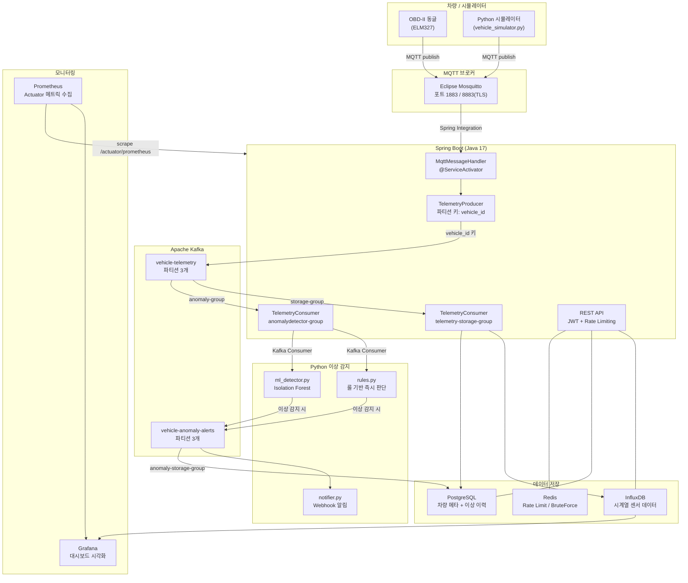

# 차량 텔레메트리 데이터 수집 & 모니터링 플랫폼

> 백엔드/서버 엔지니어 포트폴리오 프로젝트  
> 실시간 차량 센서 데이터 수집 → 이상 감지 → 시각화까지 처리하는 서버 플랫폼

---

## 프로젝트 개요

OBD-II 동글 또는 시뮬레이터에서 발생하는 차량 센서 데이터를 MQTT로 수신하고, Kafka를 통해 분산 처리한 뒤 이상 감지 및 모니터링까지 수행하는 IoT 백엔드 플랫폼입니다.

- **핵심 키워드**: 실시간 스트리밍, 대용량 처리, IoT 백엔드, 커넥티드카
- **개발 기간**: 2026.01 ~ 진행 중
- **개발자**: 박성원 (Park Sungwon)
- **모바일 앱 레포**: https://github.com/Seongwonp/vehicle-telemetry-app (Flutter, 이 백엔드의 API를 사용)

---

## 시스템 아키텍처


```mermaid
flowchart TD
    subgraph Vehicle["차량 / 시뮬레이터"]
        OBD["OBD-II 동글\n(ELM327)"]
        SIM["Python 시뮬레이터\n(vehicle_simulator.py)"]
    end

    subgraph Broker["MQTT 브로커"]
        MQ["Eclipse Mosquitto\n포트 1883 / 8883(TLS)"]
    end

    subgraph SpringBoot["Spring Boot (Java 17)"]
        MQTT_H["MqttMessageHandler\n@ServiceActivator"]
        PROD["TelemetryProducer\n파티션 키: vehicle_id"]
        CONS_S["TelemetryConsumer\ntelemetry-storage-group"]
        CONS_A["TelemetryConsumer\nanomalydetector-group"]
        API["REST API\nJWT + Rate Limiting"]
    end

    subgraph Kafka["Apache Kafka"]
        T1["vehicle-telemetry\n파티션 3개"]
        T2["vehicle-anomaly-alerts\n파티션 3개"]
    end

    subgraph Storage["데이터 저장"]
        INFLUX["InfluxDB\n시계열 센서 데이터"]
        PG["PostgreSQL\n차량 메타 + 이상 이력"]
        REDIS["Redis\nRate Limit / BruteForce"]
    end

    subgraph AnomalyDetector["Python 이상 감지"]
        RULES["rules.py\n룰 기반 즉시 판단"]
        ML["ml_detector.py\nIsolation Forest"]
        NOTIFY["notifier.py\nWebhook 알림"]
    end

    subgraph Monitoring["모니터링"]
        PROM["Prometheus\nActuator 메트릭 수집"]
        GRAFANA["Grafana\n대시보드 시각화"]
    end

    OBD -->|"MQTT publish"| MQ
    SIM -->|"MQTT publish"| MQ
    MQ -->|"Spring Integration"| MQTT_H
    MQTT_H --> PROD
    PROD -->|"vehicle_id 키"| T1

    T1 -->|"storage-group"| CONS_S
    T1 -->|"anomaly-group"| CONS_A

    CONS_S --> INFLUX
    CONS_S --> PG

    CONS_A -->|"Kafka Consumer"| RULES
    CONS_A -->|"Kafka Consumer"| ML
    RULES -->|"이상 감지 시"| T2
    ML -->|"이상 감지 시"| T2
    T2 --> NOTIFY
    T2 -->|"anomaly-storage-group"| PG

    API --- INFLUX
    API --- PG
    API --- REDIS

    PROM -->|"scrape /actuator/prometheus"| SpringBoot
    PROM --> GRAFANA
    INFLUX --> GRAFANA
```

---

## 기술 스택

| 영역 | 기술 |
|------|------|
| 데이터 수신 | MQTT (Eclipse Mosquitto) |
| 메시지 큐 | Apache Kafka |
| 백엔드 API | Java 17 + Spring Boot 3 |
| 이상 감지 | Python 3.11 (룰 기반 + scikit-learn) |
| 시계열 DB | InfluxDB |
| 관계형 DB | PostgreSQL |
| 캐시 | Redis |
| 모니터링 | Grafana + Prometheus |
| 차량 시뮬레이터 | Python / C |
| 보안 | JWT, TLS/SSL, CORS, Rate Limiting, 이상 접근 감지 |
| 인프라 | Docker Compose, AWS EC2 (선택) |

---

## 수집 데이터 스펙 (OBD-II 기준)

```json
{
  "vehicle_id": "KR-GA-1234",
  "timestamp": "2026-05-09T10:00:00Z",
  "speed": 87.3,
  "rpm": 2400,
  "engine_temp": 92.1,
  "throttle_position": 34.5,
  "fuel_level": 67.0,
  "battery_voltage": 13.8,
  "gps": {
    "lat": 37.123456,
    "lng": 127.654321
  },
  "dtc_codes": []
}
```

---

## 디렉토리 구조

```
vehicle-telemetry-platform/
├── simulator/          # 차량 데이터 시뮬레이터 (Python/C)
├── broker/             # Mosquitto MQTT 브로커 설정
├── kafka/              # Kafka 설정 및 토픽 초기화 스크립트
├── backend/            # Spring Boot API 서버
│   ├── src/
│   └── build.gradle
├── anomaly-detector/   # Python 이상 감지 모듈
├── monitoring/         # Grafana + Prometheus 설정
├── docs/               # 개발 일지 및 설계 문서
├── docker-compose.yml
├── .env.example
└── README.md
```

---

## 구현 단계 (Phase)

| Phase | 내용 | 상태 |
|-------|------|------|
| 1 | 데이터 수집 파이프라인 (시뮬레이터 → MQTT → Kafka → InfluxDB) | 완료 |
| 2 | REST API 서버 (Spring Boot + JWT + Rate Limiting) | 완료 |
| 3 | 이상 감지 (룰 기반 + Isolation Forest ML) | 완료 |
| 4 | 보안 강화 (X.509 준비, BruteForce 차단, 감사 로그) | 완료 |
| 5 | 모니터링 & 배포 (Grafana + Prometheus + Docker Compose) | 완료 |
| 6 | 버그 픽스 (Actuator 인증 우회/정보 노출, 예외 처리 보강) | 완료 |
| 7 | Refresh Token + 로그아웃 무효화 (Redis 기반) | 완료 |
| 8 | 데이터 파이프라인 안정성 (InfluxDB 동기 쓰기-수동 offset 연계, Kafka DLQ) | 완료 |
| 9 | AI 진단 (Gemini API) | 완료 |
| 10 | MQTT mTLS 실제 활성화 (기본 Compose는 8883/mTLS, 평문은 명시적 dev override만 허용) | 완료 |
| 11 | Flutter 모바일 앱 연동 — 브라우저(Flutter Web)에서 API 호출을 허용하는 CORS 지원 추가 | 완료 |
| 12 | 이상 감지 서비스(Python) 다중 인스턴스화 — 단일 인스턴스 lag 발산 문제에 Consumer Group 다중화 적용, 재검증에서 순발산 없음 확인(단, 동일 조건 A/B는 아직 — 향후 계획 참고) | 완료(검증 계속 진행 중) |
| 13 | 이상 감지 서비스 처리 신뢰성 — 수동 커밋(개수/시간 배치) + DLQ(`vehicle-telemetry-anomaly-dlq`) 도입, 발행 실패도 처리 실패로 감지 | 완료 |
| 14 | ML 이상 감지 다중 인스턴스 대응 — 슬라이딩 윈도우(버퍼 상한) + 주기적 재학습, 파티션 ID 기준 Redis 영속화로 재시작/리밸런싱 시 학습 상태 유지 | 완료 |
| 15 | 보안/신뢰성 보강 — 검증된 ID 기반 Flux 생성+InfluxDB 2.7 계약 테스트, 신뢰 프록시, STOMP 구독 인가, 차량별 mTLS/ACL, 로컬 Kafka spool, Flyway | 완료 |

---

## 향후 계획

| 항목 | 내용 |
|------|------|
| AWS EC2 배포 | Docker Compose 기반으로 실제 서버에 배포 (또는 Render 무료 티어) |
| 다중 사용자 지원 | 현재 admin 단일 계정 → DB 기반 사용자 관리로 교체. 도입 시 차량 소유자 검증(IDOR 차단)도 함께 필요 |
| DLQ 재처리 컨슈머 | 현재 DLQ는 유실 방지/격리까지만 — 재처리 자동화는 미구현 |
| 차량별 MQTT 인증서/ACL 세분화 | 완료 — backend는 `telemetry-backend` 구독자 인증서, 차량은 CN=`vehicle_id` 인증서와 `vehicle/telemetry/%u` 발행 ACL 사용 |
| InfluxDB 읽기 경로 개선 | REST 조회(`/latest`, `/telemetry`)가 InfluxDB 동시 쿼리 용량에 막혀 PostgreSQL 조회보다 최대 40배 느림 — 스케일링/캐싱/쿼리 최적화 필요 |
| InfluxDB batchSize/flush 튜닝, acks=all vs acks=1 비교 | 부하 테스트 범위에서 비교 측정하지 못함 |
| kafka-python 버전 고정 | `anomaly-detector/requirements.txt`가 `>=2.0.2`로만 열려 있어 재빌드 시마다 버전이 달라질 수 있음(재현성) |
| 이상 감지 다중화 동일 조건 A/B 재검증 | Phase 12 재측정은 부하·관찰시간·라이브러리 버전이 before/after 사이에 달랐다(코덱스 리뷰로 발견) — 동일 이미지·동일 부하·동일 시간으로 1인스턴스 vs 3인스턴스 최소 1시간 비교 + 3인스턴스 12~24시간 soak test 필요 |
| DLQ 격리 메시지 재처리 | `vehicle-telemetry-anomaly-dlq`(Phase 13에서 추가)도 기존 DLQ들과 마찬가지로 격리까지만 하고 재처리 컨슈머는 없음 |
| 이상 감지 웹훅 동기 호출 | `notifier.send_webhook`이 이상 감지마다 동기로 호출됨 — 느려지면 전체 처리량에 영향 줄 수 있어 비동기화/타임아웃 튜닝 검토 |

> Refresh Token은 Redis GETDEL 기반 rotation과 로그아웃 폐기를 지원한다. Access Token은 10분 만료의
> stateless JWT이며 별도 jti 블랙리스트는 두지 않는다. 즉시 강제 로그아웃이 요구되면 jti 블랙리스트를 추가한다.

---

## 장애 시나리오 및 동작

실제 운영에서 발생할 수 있는 장애 상황별로 시스템이 어떻게 동작하는지 정리했다.

### 시나리오 1 — Kafka 브로커 다운

| 단계 | 동작 |
|------|------|
| 장애 발생 | Spring Boot `TelemetryProducer`의 `kafkaTemplate.send()` 실패 |
| 즉각 영향 | 차량 데이터가 즉시 InfluxDB/이상 감지로 전달되지 않음 |
| MQTT 수신 | Mosquitto는 독립적으로 계속 동작. 데이터는 Spring Boot까지 도달 |
| 복구 시 | 전송 전 로컬 volume에 기록한 spool을 Kafka ACK 후 삭제하며, 재연결 시 보류 파일부터 재전송 |
| 미구현 한계 | spool volume 자체가 손실되면 복구 불가. 운영에서는 디스크 사용량 경보와 HA 수집 계층 필요 |

### 시나리오 2 — Python 이상 감지 서비스 다운

| 단계 | 동작 |
|------|------|
| 장애 발생 | `anomaly-detector` 컨테이너 종료 |
| 즉각 영향 | 이상 감지 중단, Webhook 알림 중단 |
| 데이터 파이프라인 | `telemetry-storage-group`은 별도 Consumer Group이므로 InfluxDB 저장은 영향 없이 계속됨 |
| Kafka 메시지 | `anomaly-detector-group` offset이 멈춘 상태로 유지 — 재시작 시 밀린 메시지부터 재처리 |
| 복구 시 | `docker-compose restart anomaly-detector` 후 자동으로 밀린 메시지 처리 시작 |

> Consumer Group 분리의 핵심 이점: 저장 경로와 이상 감지 경로가 독립적이므로 한 쪽 장애가 다른 쪽에 전파되지 않는다.

### 시나리오 3 — MQTT 브로커(Mosquitto) 재시작

| 단계 | 동작 |
|------|------|
| 장애 발생 | Mosquitto 컨테이너 재시작 |
| Spring Boot | `MqttPahoMessageDrivenChannelAdapter`의 `automaticReconnect=true` 설정으로 자동 재연결 시도 |
| 시뮬레이터 | `paho-mqtt`의 재연결 로직으로 자동 재구독 |
| 재연결 소요 시간 | `connectionTimeout=10s`, `keepAliveInterval=60s` 기준 수 초 내 복구 |
| 재연결 중 데이터 | 연결이 끊긴 사이 시뮬레이터가 발행한 메시지는 유실 (QoS 1 기준, 브로커 재시작이므로 세션 복원 불가) |

### 시나리오 4 — InfluxDB 쓰기 실패

| 단계 | 동작 |
|------|------|
| 장애 발생 | InfluxDB 응답 불가 또는 쓰기 타임아웃 |
| 동작 | 동기 `WriteApiBlocking` 실패를 listener가 잡아 원본을 DLQ로 발행 |
| Kafka offset | InfluxDB 쓰기 또는 DLQ 발행 성공 뒤에만 수동 커밋. DLQ 발행도 실패하면 미커밋 |
| 로그 | 저장 실패와 DLQ 실패를 서로 다른 ERROR 로그로 기록 |
| 미구현 한계 | DLQ 자동 재처리 consumer와 재시도 횟수 정책은 아직 없음 |

### 시나리오 5 — Redis 다운 (Rate Limiting / BruteForce)

| 단계 | 동작 |
|------|------|
| 장애 발생 | Redis 연결 불가 |
| Rate Limiting | `redisTemplate.opsForValue().increment()` 예외 발생 → 요청이 `preHandle()`에서 터짐 |
| 영향 범위 | Rate Limiting과 BruteForce 감지가 비활성화되는 게 아니라 API 전체가 500 응답. Refresh Token(Phase 7)도 Redis에 저장되므로 재로그인(로그인 자체는 영향 없음, 재발급만 불가)도 함께 영향받음 |
| 운영 개선 방향 | Redis 장애 시 Rate Limiting을 bypass하도록 try-catch 추가 고려 (가용성 vs 보안 트레이드오프) |

---

## 성능 (실측)

> 로컬 Docker Compose 환경(2026-07~08)에서 부하 테스트로 측정. 상세 방법론·전체 표는
> [부하 테스트 계획 및 결과](docs/load-test-plan.md) 참고.

- **수집 파이프라인**: 시뮬레이터를 3→1,000대까지 스케일해 측정. 단일 프로세스로는 Python
  GIL/스레드 오버헤드로 약 1,000-1,250 msg/s에서 먼저 벽에 부딪혀 백엔드의 진짜 한계를 잴 수
  없었다 — 부하 생성기를 여러 **프로세스**(별도 GIL)로 병렬 실행하도록 개선해 ~2,500 msg/s를
  약 24시간 지속시킨 결과, Kafka Consumer Group으로 분리해둔 두 경로 중 **이상 감지(Python,
  단일 인스턴스) 쪽만 lag이 1,264 → 200만 건 이상으로 폭주**했고, 저장 경로(Java→InfluxDB)는
  같은 시간 내내 lag 수백 단위로 버텼다. 이 시스템의 진짜 첫 확장 병목은 Kafka도 InfluxDB도
  아니라 단일 인스턴스로 도는 이상 감지 서비스였다 — Consumer Group 분리 설계(ADR-002)가
  장애(여기선 성능 저하) 전파를 실제로 막아준 것도 함께 확인.
- **이상 감지 서비스 다중화 — 12시간 soak test로 검증 완료**: `docker-compose.yml`의
  `container_name` 고정을 제거하고 `deploy.replicas: 3`으로 파티션 수(3)에 맞춰 3개 인스턴스를
  띄웠다. 동일 이미지·동일 부하(~2,300-2,700 msg/s)·시작 lag 0 조건의 1시간 A/B에서 1인스턴스는
  30분 만에 lag 140만대까지 치솟는 반면 3인스턴스는 낮게 유지됨을 먼저 확인했고, 이어서
  3인스턴스 구성으로 12시간(43,200초) soak test를 중단 없이 완주해 lag이 최대 100(평균 27.4,
  500 초과 0건)으로 장시간 안정적임을 확정했다 — 자세한 내용은
  `docs/architecture-decisions.md` ADR-016, 원시 로그는 `load-test/anomaly-detector-scale/`.
- **수집 파이프라인 99.8% 유실 발견·복구 (처리량 약 1,170배)**: 위 soak의 "InfluxDB 저장이
  26초 만에 멈췄다"를 추적하다 훨씬 큰 문제를 찾았다. **시뮬레이터가 초당 약 10,000건을
  발행하고 MQTT 브로커가 전량 수신·응답하는 동안 Kafka에는 초당 20건만 도착하고 있었다.**
  원인은 4주 전 신뢰성 개선 커밋이 남긴 두 개의 회귀였다 — (1) MQTT 수신 경로에서 메시지마다
  로컬 spool 파일을 쓰는데(파일시스템 연산 약 5회) 이게 단일 스레드에 락까지 걸린 채
  실행돼 수집 전체가 디스크 지연에 직렬로 묶였고, (2) InfluxDB 저장이 메시지당 HTTP 요청
  1건이라 요청당 WAL fsync가 지배적이었다. 둘 다 "조용한 유실을 막자"는 옳은 의도였지만
  **바꾼 뒤 처리량을 다시 재지 않아** 회귀가 드러나지 않았다 — Kafka lag은 들어온 게 없으니
  정상으로 보였다.
  계측을 붙여 원인을 특정한 뒤(InfluxDB 컨테이너가 CPU 1.66%로 놀면서도 쓰기가 5초
  타임아웃까지 걸린 게 결정적 단서였다), 저장을 배치 쓰기로 묶고 spool을 "실패 시에만"으로
  바꿔 **수집 20 → 약 9,600 msg/s, 저장 8.2 → 약 9,600 msg/s**로 복구했다. 이때
  **안전장치는 되돌리지 않았다** — 여전히 동기 쓰기로 저장을 확인한 뒤에만 offset을 커밋하고,
  spool도 Kafka 장애를 막는다. 상세는 ADR-011/ADR-019, `docs/load-test-plan.md`.
- **데이터 유실 버그 발견·수정**: InfluxDB `WritePrecision.S`(초 단위)와 시뮬레이터의 초 단위
  타임스탬프가 겹쳐, 차량당 초당 2회 조건에서 같은 초의 메시지가 서로 덮어써 **50%가
  조용히 유실**되고 있었다(Kafka lag은 0으로 정상처럼 보임). 밀리초 정밀도로 수정해
  약 100 msg/s → 약 197 msg/s(목표의 98.5%)로 회복.
- **REST API**: k6로 VU 200까지 부하 테스트. InfluxDB 기반 조회(`/telemetry/latest`, `/telemetry`)의
  p95가 3.7~3.8초까지 늘어나는 것을 확인 — 클라이언트의 동시 요청 한도를 넓혀봤다가 오히려
  InfluxDB 자체가 타임아웃을 뱉는 것을 보고 진짜 병목이 InfluxDB의 동시
  쿼리 처리 용량임을 역으로 검증(PostgreSQL 기반 `/anomalies`는 같은 부하에서 p95 95ms로 40배 빠름).
- **Rate Limit**: 분당 60회 제한이 정확히 61번째 요청부터 429를 반환하는 것을 순차 요청으로 검증.

---

## 이상 감지 룰 (Phase 3 기준)

| 항목 | 이상 조건 |
|------|----------|
| 엔진 온도 | 105°C 초과 |
| RPM | 6000 초과 |
| 배터리 전압 | 11.5V 미만 또는 15V 초과 |
| 속도 | 200km/h 초과 |
| DTC 코드 | 배열이 비어있지 않을 때 |

---

## 테스트 실행

```bash
# Java (JUnit 5)
cd backend
./gradlew test

# Python — 이상 감지 룰 테스트
cd anomaly-detector
pip install -r requirements.txt pytest
pytest

# Python — 시뮬레이터 테스트
cd simulator
pip install -r requirements.txt pytest
pytest
```

---

## 실행 방법

> Docker Compose로 전체 스택을 한 번에 실행합니다.

```bash
# 1. 환경변수 설정
cp .env.example .env
# .env 파일 편집 (GEMINI_API_KEY는 선택 — 없으면 AI 진단 기능만 동작 안 함, 나머지는 정상)

# 2. 전체 스택 실행
docker-compose up -d

# 3. 시뮬레이터 실행
cd simulator
python vehicle_simulator.py
```

---

## OBD-II 실제 연결 (ELM327 동글)

```bash
pip install obd

# 동글을 차량 OBD-II 포트에 연결 후:
import obd
connection = obd.OBD()
response = connection.query(obd.commands.SPEED)
print(response.value)  # 예: 87 kph
```

> OBD-II 동글은 읽기 전용 — 차량 제어 불가, 데이터 수집만 가능

---

## 개발 원칙

- 보안 우선: 모든 통신 TLS, 인증 없는 엔드포인트 금지
- 환경변수는 `.env`로 분리, 하드코딩 금지
- 시뮬레이터 ↔ 실제 OBD-II 전환이 쉽도록 인터페이스 분리
- 테스트: JUnit 5 (Java), pytest (Python)

---

## 문서

| 문서 | 내용 |
|------|------|
| [아키텍처 결정 기록 (ADR)](docs/architecture-decisions.md) | 기술 선택의 이유 — "무엇을 썼냐"가 아니라 "왜 이걸 골랐냐" |
| [DB 스키마](docs/db-schema.md) | PostgreSQL(메타데이터/이상 이력) + InfluxDB(시계열) 스키마 |
| [배포 가이드](docs/deployment-guide.md) | AWS EC2 배포 절차 |
| [보안 자체 점검 보고서](docs/security-report.md) | OWASP Top 10, UN R155 / ISO SAE 21434 기준 점검 결과 |
| [개발 일지](docs/devlog.md) | 날짜별 작업 내용, 결정 사항, 막힌 부분 기록 |

---

## 참고 자료

- [MQTT 프로토콜](https://mqtt.org)
- [Apache Kafka 공식 문서](https://kafka.apache.org/documentation)
- [python-OBD](https://python-obd.readthedocs.io)
- [InfluxDB 시작하기](https://docs.influxdata.com)
- [UN R155 / ISO SAE 21434 자동차 사이버보안 규제]
