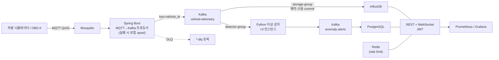

# Telemetrix — 차량 텔레메트리 수집·모니터링 백엔드

> 차량 센서 데이터를 MQTT → Kafka → InfluxDB/PostgreSQL로 흘리는 파이프라인.
> **기능 수보다 "장애 중 무엇이 유실·중복·역전됐는지를 증명할 수 있는가"에 집중한** 백엔드 포트폴리오.

- Java 17 · Spring Boot 3 · Kafka · MQTT(Mosquitto, mTLS) · InfluxDB · PostgreSQL · Redis · Python(이상 감지) · Docker Compose
- 모바일 앱(Flutter): https://github.com/Seongwonp/vehicle-telemetry-app
- 개발: 2026.01 ~ · 박성원

## 아키텍처


```mermaid
flowchart LR
    SIM["차량 시뮬레이터 / OBD-II"] -->|MQTT QoS1| MQ["Mosquitto"]
    MQ --> BE["Spring Boot\nMQTT→Kafka 프로듀서\n(실패 시 로컬 spool)"]
    BE -->|"key=vehicle_id"| K["Kafka\nvehicle-telemetry"]
    K -->|"storage-group\n배치·수동 commit"| INF["InfluxDB"]
    K -->|"detector-group"| PY["Python 이상 감지\n×3 인스턴스"]
    PY --> KA["Kafka\nanomaly-alerts"] --> PG["PostgreSQL"]
    INF & PG & RD["Redis\n(rate limit)"] --- API["REST + WebSocket\nJWT"]
    BE -. DLQ .-> DLQ["*-dlq 토픽"]
    API --> PROM["Prometheus / Grafana"]
```

설계 결정 28건과 이유는 [ADR](docs/architecture-decisions.md).

## 핵심 결과 5개 — 결과별 재현·원본 보존 범위를 구분한다

초기 72% 유실 등 일부 과거 관찰은 원본 로그가 남아 있지 않다. 수정 후 반복 실행의
원본은 보존했지만 최초 실패의 원본을 대신하지 않는다. 각 결과 문서의 검증 상태·한계를 함께 본다.

| 무엇을 찾았나 | 원인 | 결과 | 근거 |
| --- | --- | --- | --- |
| **MQTT 브로커 90초 장애에서 72% 유실** | Paho 재연결 상한 기본값 128초 동안 브로커 큐(10k)가 넘침. 우리 지표는 "받은 것"만 세서 정상으로 보였고, 브로커 `$SYS` dropped만 알고 있었다 | 상한 5초·큐 100k → **유실 0, 90초 장애 반복 관찰 3/3**(평문 dev, 세 회차 모두 dirty 트리라 `검증 완료` 아님. 300초는 1회) | [ADR-021](docs/architecture-decisions.md), [결과](load-test/fault-injection/RESULT_20260905_mqtt_broker.md) |
| **수집 파이프라인 99.8% 유실** (10,000 → 20 msg/s) | "안전하게" 넣은 메시지당 spool 파일 쓰기 + InfluxDB 건당 HTTP가 직렬 병목. 바꾼 뒤 처리량을 안 재서 4주간 몰랐다 | 배치 쓰기 + spool은 실패 시에만 → 저장 처리량 8.2 → **약 9,600 msg/s**, 안전장치 유지. **1회 관찰, 원시 로그 미보존** — 회복을 보인 값이지 처리량 상한이 아니다. spool "실패 시에만"은 09-29에 드레인 한 번 뒤 깨지는 결함을 찾아 수정했다(단위 테스트만, 실스택 재관찰 없음) | [ADR-011](docs/architecture-decisions.md), [ADR-019](docs/architecture-decisions.md), [측정 기록](docs/load-test-plan.md) |
| **저장 실패가 조용히 유실되는 구조** | auto-commit + 단건 처리 | InfluxDB 저장 성공 **또는 DLQ 발행 성공 뒤에만** 수동 commit. DLQ 발행 실패면 offset 안 넘김. 재처리 횟수 헤더 전파 | [ADR-012](docs/architecture-decisions.md), [Runbook](docs/runbook/dlq-reprocessing.md) |
| **단일 이상 감지 인스턴스가 첫 확장 병목** | 감지기 1개가 유입의 약 88%만 처리. 저장과는 Consumer Group이 달라(ADR-002) 서로 막지 않는다 | 1 vs 3 인스턴스 A/B(각 arm 1회, 4~5분)에서 1개는 lag 선형 발산, 3개는 1,500 이하. 3인스턴스 **6시간 soak 1회**(평균 7,497 msg/s) lag 평균 914, 드리프트 없음(이 조건 한정). 초기 24h 관찰은 원본이 없고 당시 저장 lag은 '저장'이 아니라 '소비'였다 — 근거로 쓰지 않는다 | [ADR-016](docs/architecture-decisions.md), [6h soak](load-test/anomaly-detector-scale/AB7_soak_summary_20260903.md) |
| **같은 초 타임스탬프로 50% 덮어쓰기** | InfluxDB 초 정밀도. Kafka lag은 0이라 정상처럼 보임 | 밀리초 정밀도 → 차량 1대당 200 msg/s 이하에서 충돌 0(각 속도 1회). 차량당 1,000 msg/s부터는 밀리초 충돌로 다시 유실(1,000에서 0.64%, 2,000에서 50%). 초기 50%·회복 수치는 원시 로그 미보존. 이후 입력 계약(필수 필드 누락·범위 밖 거부, 누락이 0으로 저장되던 것 차단 — 숫자 문자열은 허용) | [ADR-014](docs/architecture-decisions.md), [입력 계약](docs/telemetry-schema-decision-table.md) |

그 외: Redis 장애 시 조회 fail-open / 로그인·진단 fail-closed 분리(각 1회, 무부하 — 부하 중은 미검증, [정책](docs/redis-failure-policy.md)),
독성 메시지 1건이 정상 100건을 막지 않음(유형별 1회), REST 소유권 검사(ADR-025, 테스트 수준), MQTT mTLS(ADR-013),
사용자·소유권 RDB 모델과 200만 행 `EXPLAIN`(1회 관찰)으로 조정한 인덱스·목록 N+1([ADR-027](docs/architecture-decisions.md), [실행계획](docs/verification/2026-09-27-postgres-explain.md)),
비밀번호 변경·초기화 API(ADR-027, 테스트 수준 — 컨테이너 E2E 미실시),
한 건 추적 키 `(vehicle_id, timestamp)`가 재전달·spool 드레인·DLQ 재주입·WebSocket 뒤에도 유지되는지 각 1회 관찰(ADR-028, [검증](docs/verification/2026-09-29-trace-redelivery-spool.md)),
WebSocket 방송 실패가 커밋된 배치를 재시도시키지 않게 함(단위 테스트, 실제 STOMP 예외 재현 없음).
전체 실험 서사와 수치는 [상세 기록](docs/portfolio-detail.md).

2026-10-01: MQTT ACK를 Kafka 또는 spool 기록 뒤로 이동했다([ADR-029](docs/architecture-decisions.md), [부분 검증](docs/verification/2026-10-01-mqtt-ack-boundary.md)). 수신 스레드가 완료를 기다리므로 위 과거 처리량을 현재 구현의 처리량으로 사용하지 않는다. 브로커·호스트 강제 종료까지 보호하는 변경은 아니다.

## 검증 방식

- **테스트**: Java 300+건(Testcontainers 계약 7종, CI가 skip 0 강제) · Python pytest · Java/Python이 **같은 fixture 61건**으로 입력 계약 판정 일치 확인
- **실험 규칙**: 가설·대조군·성공 기준을 먼저 적고, 발행 시도 수가 아니라 **PUBACK·Kafka offset·InfluxDB 행 수를 대조**한다. 안정성 주장은 같은 조건 3회 이상에서만 — [증거 정책](docs/evidence-policy.md)
- **증거 보존**: 실행마다 `load-test/<시나리오>/evidence/<run-id>/`에 commit SHA·명령·원본 로그·checksum. CI가 checksum 전수 검사

## 말하지 않는 것

- exactly-once, 모든 조건에서 무손실, 고가용성(broker 1대, RF=1)
- 최대 처리량 수치(반복 결과가 크게 흔들려 철회)
- 실제 OBD-II 연결, 운영 배포, 앱 실기기 E2E — 전부 **미검증**

## 실행

```bash
cp .env.example .env        # 비밀값 채우기
docker compose -f docker-compose.yml -f docker-compose.dev.yml --profile simulator up -d   # 평문 dev
curl http://localhost:8080/actuator/health          # Swagger: /swagger-ui.html, Grafana: :3000
cd backend && ./gradlew test                        # Docker 필요(Testcontainers)
```

기본 `docker-compose.yml`만 쓰면 mTLS(8883)라 `broker/certs/generate-certs.sh`가 먼저 필요하다.

## 문서

| | |
| --- | --- |
| [상세 기록](docs/portfolio-detail.md) | 장애 시나리오별 동작, 실측 서사 전체 |
| [ADR](docs/architecture-decisions.md) | 왜 이렇게 골랐고 무엇을 포기했는지 |
| [로드맵](docs/roadmap.md) · [현재 상태 감사](docs/current-state-audit-2026-09-09.md) | 완료/미검증 경계와 다음 작업 |
| [Runbook](docs/runbook/) | DLQ 재처리, Redis 장애, 저장 스케일아웃, 사용자 스키마 전환, 한 건 끝까지 찾기 |
| [개발 일지](docs/devlog.md) | 어디서 틀렸고 무엇이 그걸 드러냈는지 |
