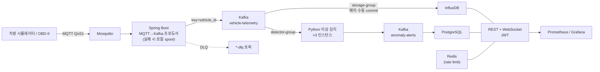

# Telemetrix — 차량 텔레메트리 수집·모니터링 백엔드

> 차량 센서 데이터를 MQTT → Kafka → InfluxDB/PostgreSQL로 흘리는 파이프라인.
> **기능 수보다 "장애 중 무엇이 유실·중복·역전됐는지를 증명할 수 있는가"에 집중한** 백엔드 포트폴리오.

- Java 17 · Spring Boot 3 · Kafka · MQTT(Mosquitto, mTLS) · InfluxDB · PostgreSQL · Redis · Python(이상 감지) · Docker Compose
- 모바일 앱(Flutter): https://github.com/Seongwonp/vehicle-telemetry-app
- 개발: 2026.01 ~ · 박성원

## 아키텍처


```mermaid
flowchart LR
    SIM["차량 시뮬레이터 / OBD-II"] -->|MQTT QoS1| MQ["Mosquitto"]
    MQ --> BE["Spring Boot\nMQTT→Kafka 프로듀서\n(실패 시 로컬 spool)"]
    BE -->|"key=vehicle_id"| K["Kafka\nvehicle-telemetry"]
    K -->|"storage-group\n배치·수동 commit"| INF["InfluxDB"]
    K -->|"detector-group"| PY["Python 이상 감지\n×3 인스턴스"]
    PY --> KA["Kafka\nanomaly-alerts"] --> PG["PostgreSQL"]
    INF & PG & RD["Redis\n(rate limit)"] --- API["REST + WebSocket\nJWT"]
    BE -. DLQ .-> DLQ["*-dlq 토픽"]
    API --> PROM["Prometheus / Grafana"]
```

설계 결정 30건과 이유는 [ADR](docs/architecture-decisions.md).

## 대표 사례 3개 — 문제 → 변경 → 검증 결과

결과마다 실행 횟수와 검증 상태를 [증거 정책](docs/evidence-policy.md)의 표현으로 적는다. 초기 72% 유실 등 일부 과거 관찰은
원본 로그가 남아 있지 않다. 수정 후 반복 실행의 원본은 보존했지만 최초 실패의 원본을 대신하지 않는다.

| 문제 | 변경 | 검증 결과 | 근거 |
| --- | --- | --- | --- |
| **MQTT 브로커 90초 장애에서 72% 유실** — Paho 재연결 상한 기본값 128초 동안 브로커 큐(10k)가 넘침. 우리 지표는 "받은 것"만 세서 정상으로 보였고, 브로커 `$SYS` dropped만 알고 있었다 | 상한 5초·큐 100k | **유실 0, 90초 장애 반복 관찰 3/3**(평문 dev, 세 회차 모두 dirty 트리라 `검증 완료` 아님. 300초는 1회) | [ADR-021](docs/architecture-decisions.md), [결과](load-test/fault-injection/RESULT_20260905_mqtt_broker.md) |
| **저장 실패가 조용히 유실되는 구조** — auto-commit + 단건 처리 | InfluxDB 저장 성공 **또는 DLQ 발행 성공 뒤에만** 수동 commit. DLQ 발행 실패면 offset 안 넘김. 재처리 횟수 헤더 전파 | **회귀 검증** — 단위 2건 + 실제 Kafka(Testcontainers) 계약 4건이 이 경계를 고정, CI가 skip 0 강제. 실스택 InfluxDB 12분 정지는 **1회 관찰**: 원본 258,726 ≤ 저장 252,615 + DLQ 6,158 → 유실 0(47건 초과는 재전달), 리밸런싱 0 | [ADR-012](docs/architecture-decisions.md), [테스트 목록](load-test/schema-contract/RESULT_20260909_contract_e2e.md), [12분 장애](load-test/long-outage/RESULT_20260906_influxdb.md), [Runbook](docs/runbook/dlq-reprocessing.md) |
| **연료량·전압 미지원 차량은 아무것도 못 보냄** — 숫자 6개가 전부 필수라 PID 하나만 미지원이어도 속도·RPM·온도까지 미전송. 선택으로 바꾸면 fleet 최신값(`last()`+pivot)이 필드별 `last()`로 **옛 포인트의 연료·전압을 최신 행에 섞을** 수 있다 | 두 필드만 선택(없으면 InfluxDB에 **쓰지 않음**, 0 아님), 나머지 넷은 필수 유지. fleet 조회는 최신 `_time` 행만 남겨 그 필드는 null. 배포 순서 감지기 → 백엔드 → 브리지 | 공유 fixture 80칸 Java·Python 같은 판정, 실제 InfluxDB 2.7 계약 테스트로 "옛 값 섞임 없음" 고정(**회귀 검증**). 실스택 E2E **1회 관찰**(차량 1대·3건): 필수 필드 행 3, 선택 필드 행 1, 저전압 알림은 값이 있는 1건만. 실차·앱 화면은 미검증 | [ADR-030](docs/architecture-decisions.md), [E2E](docs/verification/2026-10-08-optional-fields-e2e.md), [계약 테스트](backend/src/test/java/com/telemetry/contract/InfluxDbContractTest.java) |

그 외 결과(수집 99.8% 유실 복구, 이상 감지 확장, 타임스탬프 덮어쓰기, Redis 장애 정책, 추적 키 등)는
[상세 기록 — README에서 옮긴 결과](docs/portfolio-detail.md#readme에서-옮긴-결과).

2026-10-01: MQTT ACK를 Kafka 또는 spool 기록 뒤로 이동했다([ADR-029](docs/architecture-decisions.md), [부분 검증](docs/verification/2026-10-01-mqtt-ack-boundary.md)). 수신 스레드가 완료를 기다리므로 과거 처리량을 현재 구현의 처리량으로 사용하지 않는다. 브로커·호스트 강제 종료까지 보호하는 변경은 아니다.

## 검증 방식

- **테스트**: Java 300+건(Testcontainers 계약 7종, CI가 skip 0 강제) · Python pytest · Java/Python이 **같은 fixture 61건**으로 입력 계약 판정 일치 확인
- **실험 규칙**: 가설·대조군·성공 기준을 먼저 적고, 발행 시도 수가 아니라 **PUBACK·Kafka offset·InfluxDB 행 수를 대조**한다. 안정성 주장은 같은 조건 3회 이상에서만 — [증거 정책](docs/evidence-policy.md)
- **증거 보존**: 실행마다 `load-test/<시나리오>/evidence/<run-id>/`에 commit SHA·명령·원본 로그·checksum. CI가 checksum 전수 검사

## 말하지 않는 것

- exactly-once, 모든 조건에서 무손실, 고가용성(broker 1대, RF=1)
- 최대 처리량 수치(반복 결과가 크게 흔들려 철회)
- 실제 OBD-II 연결, 운영 배포, 앱 실기기 E2E — 전부 **미검증**

## 실행

```bash
cp .env.example .env        # 비밀값 채우기
docker compose -f docker-compose.yml -f docker-compose.dev.yml --profile simulator up -d   # 평문 dev
curl http://localhost:8080/actuator/health          # Swagger: /swagger-ui.html, Grafana: :3000
cd backend && ./gradlew test                        # Docker 필요(Testcontainers)
```

기본 `docker-compose.yml`만 쓰면 mTLS(8883)라 `broker/certs/generate-certs.sh`가 먼저 필요하다.

## 문서

| | |
| --- | --- |
| [상세 기록](docs/portfolio-detail.md) | 장애 시나리오별 동작, 실측 서사 전체 |
| [ADR](docs/architecture-decisions.md) | 왜 이렇게 골랐고 무엇을 포기했는지 |
| [로드맵](docs/roadmap.md) · [현재 상태 감사](docs/current-state-audit-2026-09-09.md) | 완료/미검증 경계와 다음 작업 |
| [Runbook](docs/runbook/) | DLQ 재처리, Redis 장애, 저장 스케일아웃, 사용자 스키마 전환, 한 건 끝까지 찾기 |
| [개발 일지](docs/devlog.md) | 어디서 틀렸고 무엇이 그걸 드러냈는지 |
