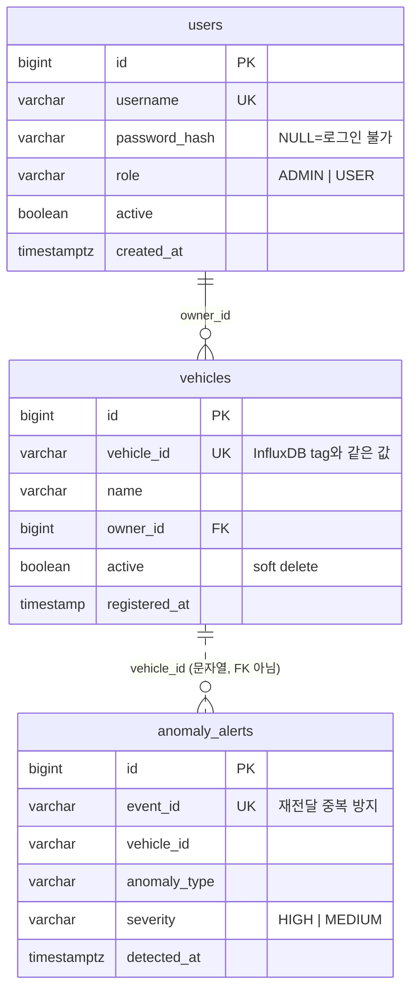

# DB 스키마 문서

## 1. PostgreSQL (관계형 DB)

차량 메타데이터와 이상 감지 이력을 저장한다. 시계열 데이터(센서 값)는 InfluxDB가 담당하고,
PostgreSQL은 "어떤 차량이 등록되어 있는가"와 "어떤 이상이 발생했는가"의 구조화된 정보를 관리한다.

---

### ERD



> **`anomaly_alerts.vehicle_id`가 FK가 아닌 이유**: 알림은 Kafka 컨슈머가 배치로 넣는다. 등록 전 차량(또는
> 등록을 안 하는 시뮬레이터 차량)의 알림이 FK 위반으로 배치 전체를 되돌리면 저장 경로가 **차량 등록 여부에 묶인다.**
> InfluxDB 텔레메트리도 같은 이유로 등록과 무관하게 저장된다. 접근 제어는 조회 시점에 `vehicles`로 건다(ADR-025).

---

### `users` 테이블 (V4, ADR-027)

로그인 계정. 2026-09-27까지는 `InMemoryUserDetailsManager`의 admin 한 명이었고 `vehicles.owner`는 자유 문자열이었다.

| 컬럼 | 타입 | 제약 | 설명 |
|------|------|------|------|
| `id` | BIGINT | PK | 내부 식별자 |
| `username` | VARCHAR(50) | UNIQUE, NOT NULL | 로그인 이름. JWT `sub` |
| `password_hash` | VARCHAR(100) | | BCrypt. **NULL이면 로그인 불가** — V4가 옛 owner 문자열에서 백필한 계정, 또는 기동 전의 admin |
| `role` | VARCHAR(10) | NOT NULL, CHECK IN ('ADMIN','USER') | `ROLE_` 접두는 코드가 붙인다 |
| `active` | BOOLEAN | NOT NULL, DEFAULT true | false면 로그인 불가 |
| `created_at` | TIMESTAMPTZ | NOT NULL, DEFAULT now() | |

- 관리자 행은 V4가 Flyway placeholder `${admin_username}`(= `ADMIN_USERNAME`)으로 만들고, 해시는 기동 시
  `AdminBootstrap`이 `ADMIN_PASSWORD`로 채운다. **env가 관리자 비밀번호의 단일 기준**이다.
- 자가 가입은 없다. `POST /api/users`는 관리자만.

---

### `vehicles` 테이블

차량 등록 정보. 물리 삭제 없이 `active` 플래그로 비활성화한다.

> **soft delete를 쓰는 이유**: `vehicle_id`는 InfluxDB 텔레메트리 데이터의 tag로 연결되어 있어,
> 행을 삭제하면 과거 센서 이력 조회 시 차량 정보를 찾지 못한다.

| 컬럼 | 타입 | 제약 | 설명 |
|------|------|------|------|
| `id` | BIGINT | PK, AUTO_INCREMENT | 내부 식별자 |
| `vehicle_id` | VARCHAR(50) | UNIQUE, NOT NULL | 외부 식별자 (예: `KR-GA-1234`) |
| `name` | VARCHAR(100) | | 차량 이름/별칭 |
| `owner_id` | BIGINT | FK → users.id, NOT NULL | 소유자. V4 이전엔 `owner VARCHAR(100)` 자유 문자열 |
| `active` | BOOLEAN | NOT NULL, DEFAULT true | false = 비활성화(soft delete) |
| `registered_at` | TIMESTAMP | NOT NULL, 자동 설정 | 등록 시각 |

```sql
CREATE INDEX idx_vehicles_owner_active ON vehicles (owner_id) WHERE active;
```

> **V4 백필 규칙**: 옛 `owner` 문자열마다 `users` 행을 **비활성·해시 없음**으로 만들어 연결한다(데이터를 admin 소유로
> 조용히 바꾸지 않는다). `owner`가 NULL이던 행만 관리자 소유가 된다 — 그 행은 이전에도 소유자 검사에서 아무도 통과
> 못 했으므로 권한이 늘지 않는다. `FlywayPostgresContractTest`가 실제 PostgreSQL에서 이 백필을 확인한다.

---

### `anomaly_alerts` 테이블

Python anomaly-detector가 발행한 이상 감지 이벤트를 Spring Boot Kafka Consumer가 저장한다.

| 컬럼 | 타입 | 제약 | 설명 |
|------|------|------|------|
| `id` | BIGINT | PK, AUTO_INCREMENT | 내부 식별자 |
| `event_id` | VARCHAR(64) | UNIQUE, NOT NULL | Kafka 재전달 중복 방지용 결정적 SHA-256 ID |
| `vehicle_id` | VARCHAR(50) | NOT NULL, INDEX | 이상이 발생한 차량 ID |
| `anomaly_type` | VARCHAR(255) | NOT NULL | 이상 유형 (예: `엔진 과열`, `RPM 과부하`) |
| `field` | VARCHAR(50) | | 이상이 감지된 필드명 (예: `engine_temp`) |
| `value` | DOUBLE | | 감지 시점의 실제 값 |
| `threshold` | VARCHAR(200) | | 임계값 설명 (예: `engine_temp > 105°C`) |
| `severity` | VARCHAR(10) | | 심각도: `HIGH` or `MEDIUM` |
| `detector` | VARCHAR(10) | | 감지기: `RULE` or `ML` |
| `vehicle_timestamp` | TIMESTAMP | | 차량 센서 원본 타임스탬프 |
| `detected_at` | TIMESTAMP | NOT NULL, INDEX | 이상 감지 시각 |

```sql
CREATE TABLE anomaly_alerts (
    id                BIGSERIAL PRIMARY KEY,
    event_id          VARCHAR(64) NOT NULL UNIQUE,
    vehicle_id        VARCHAR(50)  NOT NULL,
    anomaly_type      VARCHAR(255) NOT NULL,
    field             VARCHAR(50),
    value             DOUBLE PRECISION,
    threshold         VARCHAR(200),
    severity          VARCHAR(10),
    detector          VARCHAR(10),
    vehicle_timestamp TIMESTAMPTZ,
    detected_at       TIMESTAMPTZ  NOT NULL
);

CREATE INDEX idx_anomaly_vehicle_id  ON anomaly_alerts (vehicle_id);
CREATE INDEX idx_anomaly_detected_at ON anomaly_alerts (detected_at);
CREATE INDEX idx_anomaly_vehicle_detected_at ON anomaly_alerts (vehicle_id, detected_at DESC);
CREATE INDEX idx_anomaly_vehicle_high ON anomaly_alerts (vehicle_id) WHERE severity = 'HIGH';  -- V5
```

> **인덱스 선택 이유**: 대부분의 조회 패턴이 "특정 차량의 최근 N건" 형태이므로
> 복합 인덱스(`vehicle_id, detected_at DESC`)로 차량 필터와 최신순 정렬을 함께 처리한다.
> 단독 인덱스는 전체 차량 기준 조회와 기존 운영 쿼리 호환을 위해 유지한다.
>
> **`idx_anomaly_vehicle_high`(V5)**: 차량 목록의 HIGH 건수가 차량마다 heap 4,000블록을 읽어 7.1ms였다(200만 행, HIGH 25%).
> HIGH만 담는 부분 인덱스로 Index Only Scan 0.96ms·3.5MB(복합 인덱스 14MB보다 작다). 호출도 차량마다가 아니라
> `GROUP BY` 1회로 바꿨다(인덱스가 시간을, GROUP BY가 왕복을 줄인다) — [`verification/2026-09-27-postgres-explain.md`](verification/2026-09-27-postgres-explain.md).

---

## 2. InfluxDB (시계열 DB)

실시간 센서 데이터를 저장한다. 관계형 DB와 달리 스키마를 명시적으로 생성하지 않으며,
첫 데이터가 쓰여질 때 measurement와 필드가 자동 생성된다.

- **Bucket**: `vehicle-telemetry`
- **Retention**: 30일 (기본값, 운영 시 조정)
- **Measurement**: `vehicle_telemetry`

### Tags (인덱싱 대상)

| 태그 | 값 예시 | 설명 |
|------|---------|------|
| `vehicle_id` | `KR-GA-1234` | 차량 식별자. tag는 자동 인덱싱되어 차량별 필터 쿼리가 빠르다. |

> InfluxDB에서 tag는 내부적으로 인덱싱되고, field는 인덱싱되지 않는다.
> `vehicle_id`를 field로 넣으면 "특정 차량 데이터만 조회"하는 쿼리가 풀스캔이 된다.

### Fields (측정값)

| 필드 | 타입 | 단위 | 설명 |
|------|------|------|------|
| `speed` | float | km/h | 주행 속도 |
| `rpm` | float | RPM | 엔진 회전수 |
| `engine_temp` | float | °C | 엔진 냉각수 온도 |
| `throttle_position` | float | % | 스로틀 개도율 |
| `fuel_level` | float | % | 연료 잔량 |
| `battery_voltage` | float | V | 배터리 전압 |
| `lat` | float | 도(degree) | GPS 위도 (선택) |
| `lng` | float | 도(degree) | GPS 경도 (선택) |
| `dtc_codes` | string | - | OBD-II 진단 코드, 쉼표 구분 (선택) |

### 쿼리 예시 (Flux)

```flux
// 특정 차량의 최근 1시간 데이터 10건
from(bucket: "vehicle-telemetry")
  |> range(start: -1h)
  |> filter(fn: (r) => r._measurement == "vehicle_telemetry")
  |> filter(fn: (r) => r.vehicle_id == "KR-GA-1234")
  |> pivot(rowKey: ["_time"], columnKey: ["_field"], valueColumn: ["_value"])
  |> sort(columns: ["_time"], desc: true)
  |> limit(n: 10)
```

---

## 3. Redis (캐시 / 카운터)

영속성보다 속도가 중요한 임시 데이터를 저장한다.

| 키 패턴 | 타입 | TTL | 설명 |
|---------|------|-----|------|
| `rate_limit:{clientIp}` | String (정수) | 1분 | IP별 분당 요청 카운터 |
| `brute_force:{clientIp}` | String (정수) | 15분 | IP별 로그인 실패 횟수 |

> **TTL 설계 원칙**: 두 카운터 모두 첫 요청/실패 시점에만 TTL을 설정한다.
> 매 요청마다 TTL을 리셋하면 윈도우가 끝나지 않아 의도한 시간 제한이 동작하지 않는다.

### Rate Limiting 동작 방식

1. 요청이 들어오면 `INCR rate_limit:{ip}` 실행 (원자 연산)
2. 카운트가 1이면 TTL 1분 설정
3. 카운트가 설정값(`rate-limit.requests-per-minute`) 초과 시 HTTP 429 반환
4. 1분 후 키 자동 만료 → 카운터 초기화

### BruteForce 감지 동작 방식

1. 로그인 실패 시 `INCR brute_force:{ip}` 실행
2. 첫 실패 시 TTL 15분 설정
3. 카운트 5 이상이면 이후 로그인 시도 즉시 차단 (HTTP 429)
4. 15분 후 키 자동 만료 → 차단 해제
